# DWARF Reconstructor Class Diagram

This diagram shows the architecture of the DWARF-to-C++ header reconstructor using domain-driven design.

```mermaid
classDiagram
    %% Application Layer
    class DwarfGenerator {
        -Path elf_path
        -LazyDwarfIndexService dwarf_index
        -LazyTypeResolver type_resolver
        -ClassParser class_parser
        -HeaderGenerator header_generator
        -HierarchyBuilder hierarchy_builder
        +__init__(elf_path: Path)
        +generate_header(class_name: str) str
        +generate_hierarchy_header(class_name: str) str
        +generate_complete_hierarchy_header(class_name: str) str
        +find_class(name: str) tuple~CompileUnit, DIE~
        +close()
    }

    %% Domain Layer - Models
    class ClassInfo {
        +str name
        +int byte_size
        +list~MemberInfo~ members
        +list~MethodInfo~ methods
        +list~str~ base_classes
        +list~EnumInfo~ enums
        +list~StructInfo~ nested_structs
        +list~UnionInfo~ unions
        +int|None alignment
        +str|None declaration_file
        +int|None declaration_line
        +int|None die_offset
        +dict|None packing_info
        +list~TemplateTypeParam~ template_type_params
        +list~TemplateValueParam~ template_value_params
    }

    class MemberInfo {
        +str name
        +str type
        +int byte_offset
        +int|None bit_size
        +int|None bit_offset
        +int|None type_offset
    }

    class MethodInfo {
        +str name
        +str return_type
        +list~ParameterInfo~ parameters
        +bool is_virtual
        +bool is_static
        +bool is_const
        +int|None vtable_index
        +int|None return_type_offset
    }

    class EnumInfo {
        +str name
        +str type
        +dict~str,int~ enumerators
    }

    class StructInfo {
        +str name
        +int byte_size
        +list~MemberInfo~ members
    }

    class UnionInfo {
        +str name
        +int byte_size
        +list~MemberInfo~ members
    }

    %% Domain Layer - Services (Parsing)
    class ClassParser {
        -LazyTypeResolver type_resolver
        -LazyDwarfIndexService dwarf_index
        +__init__(type_resolver, dwarf_index)
        +find_class(name: str) tuple~CompileUnit, DIE~|None
        +parse_class_info(cu: CompileUnit, die: DIE) ClassInfo
        -_parse_members(class_die: DIE) list~MemberInfo~
        -_parse_methods(class_die: DIE) list~MethodInfo~
        -_parse_nested_types(class_die: DIE)
    }

    class DIETypeClassifier {
        <<static>>
        +is_class_type(die: DIE) bool
        +is_enum_type(die: DIE) bool
        +is_struct_type(die: DIE) bool
        +is_union_type(die: DIE) bool
        +is_forward_declaration(die: DIE) bool
        +is_namespace(die: DIE) bool
        +should_resolve_as_dependency(die: DIE) bool
    }

    %% Domain Layer - Services (Generation)
    class HeaderGenerator {
        -LazyDwarfIndexService dwarf_index
        +__init__(dwarf_index)
        +generate_header(class_info, typedefs, cu_offset) str
        +generate_hierarchy_header(class_infos, hierarchy_order) str
        -_generate_forward_declarations(class_infos, hierarchy_order) str
        -_generate_class_definition(class_info) str
        -_generate_members(members) str
        -_generate_methods(methods) str
        -_generate_enum(enum_info) str
        -_generate_struct(struct_info) str
        -_generate_union(union_info) str
    }

    class HierarchyBuilder {
        -ClassParser class_parser
        -LazyDwarfIndexService dwarf_index
        -DependencyExtractor dependency_extractor
        +__init__(class_parser, dwarf_index)
        +build_full_hierarchy(class_name) tuple~dict, list~
        +build_full_hierarchy_with_dependencies(class_name, max_depth) tuple~dict, list~
        -_find_base_class(class_die) str|None
        -_process_dependencies_offset_based(class_infos, max_depth) dict~str, ClassInfo~
    }

    class DependencyExtractor {
        -LazyDwarfIndexService dwarf_index
        +__init__(dwarf_index)
        +extract_dependencies(class_info) set~int~
        +filter_resolvable_types(offsets) set~int~
        -_get_member_type_offset(member) int|None
        -_get_method_return_type_offset(method) int|None
        -_get_parameter_type_offset(param) int|None
        -_extract_struct_dependencies(struct, deps)
        -_extract_union_dependencies(union, deps)
    }

    %% Core Layer
    class LazyTypeResolver {
        -DWARFInfo dwarf_info
        -LazyDwarfIndexService dwarf_index
        -dict~int,str~ _type_cache
        -set~int~ PRIMITIVE_TYPEDEFS
        +__init__(dwarf_info, dwarf_index)
        +resolve_type(die: DIE) str|None
        +resolve_type_from_offset(offset: int) str|None
        +discover_typedefs() dict~str,str~
        -_resolve_type_chain(die, visited) str|None
        -_format_pointer_type(base_type, qualifiers) str
        -_format_array_type(die, base_type) str
    }

    class LazyDwarfIndexService {
        -DWARFInfo dwarf_info
        -dict~int,DIE~ _offset_index
        -bool _index_built
        +__init__(dwarf_info)
        +get_die_by_offset(offset: int) DIE|None
        +extract_die_by_offset(offset: int) DIE|None
        -_build_offset_index()
        -_index_dies_in_cu(cu)
    }

    %% Infrastructure Layer
    class PersistentSymbolCache {
        -Path cache_dir
        -dict~str,Any~ _memory_cache
        -int max_memory_size
        +__init__(cache_dir, max_memory_size)
        +get(symbol_name: str) ClassInfo|None
        +put(symbol_name: str, class_info: ClassInfo)
        +clear()
        +get_stats() dict
        -_get_cache_path(symbol_name) Path
        -_serialize(class_info) bytes
        -_deserialize(data) ClassInfo
    }

    class PackingAnalyzer {
        <<static>>
        +calculate_packing_info(class_info: ClassInfo) dict~str,int~
        -_calculate_padding(members, byte_size) int
        -_calculate_alignment(members) int
        -_infer_packing(members) int
    }

    class DwarfConfig {
        <<dataclass>>
        +int max_depth
        +bool enable_caching
        +bool verbose_logging
        +str cache_dir
    }

    %% Relationships - Application Layer
    DwarfGenerator --> ClassParser : uses
    DwarfGenerator --> HeaderGenerator : uses
    DwarfGenerator --> HierarchyBuilder : uses
    DwarfGenerator --> LazyTypeResolver : uses
    DwarfGenerator --> LazyDwarfIndexService : uses

    %% Relationships - Domain Models
    ClassInfo *-- MemberInfo : contains
    ClassInfo *-- MethodInfo : contains
    ClassInfo *-- EnumInfo : contains
    ClassInfo *-- StructInfo : contains
    ClassInfo *-- UnionInfo : contains
    MethodInfo *-- MemberInfo : parameters

    %% Relationships - Parsing Services
    ClassParser --> LazyTypeResolver : resolves types
    ClassParser --> LazyDwarfIndexService : finds DIEs
    ClassParser --> ClassInfo : creates
    ClassParser --> DIETypeClassifier : validates types

    %% Relationships - Generation Services
    HeaderGenerator --> LazyDwarfIndexService : validates offsets
    HeaderGenerator --> DIETypeClassifier : filters types
    HeaderGenerator --> ClassInfo : reads

    HierarchyBuilder --> ClassParser : parses classes
    HierarchyBuilder --> DependencyExtractor : extracts dependencies
    HierarchyBuilder --> LazyDwarfIndexService : resolves offsets
    HierarchyBuilder --> ClassInfo : builds

    DependencyExtractor --> LazyDwarfIndexService : resolves offsets
    DependencyExtractor --> DIETypeClassifier : classifies types
    DependencyExtractor --> ClassInfo : reads

    %% Relationships - Core Services
    LazyTypeResolver --> LazyDwarfIndexService : finds DIEs
    LazyTypeResolver --> PersistentSymbolCache : caches types

    %% Relationships - Infrastructure
    DwarfGenerator --> PersistentSymbolCache : caches symbols
    DwarfGenerator --> PackingAnalyzer : analyzes packing
    DwarfGenerator --> DwarfConfig : configured by

    %% Notes
    note for DwarfGenerator "Application Layer\nOrchestrates parsing and generation"
    note for ClassParser "Domain Layer\nParses DWARF DIEs into ClassInfo"
    note for HeaderGenerator "Domain Layer\nGenerates C++ headers with two-phase algorithm"
    note for HierarchyBuilder "Domain Layer\nBuilds inheritance chains and resolves dependencies recursively"
    note for LazyTypeResolver "Core Layer\nOn-demand type resolution with caching"
    note for LazyDwarfIndexService "Core Layer\nEfficient DIE offset lookup (O(1) after index)"
```

## Architecture Overview

The system follows **domain-driven design** with clear separation of concerns:

### Application Layer
- **DwarfGenerator**: Main orchestrator that coordinates all components
- Entry point for header generation operations
- Manages lifecycle (file opening/closing)

### Domain Layer

#### Models (`domain/models/dwarf/`)
- **ClassInfo**: Complete class representation with members, methods, inheritance
- **MemberInfo**: Field data (type, offset, bit fields)
- **MethodInfo**: Method signatures with parameters and virtual table info
- **EnumInfo**, **StructInfo**, **UnionInfo**: Nested type definitions

#### Services - Parsing (`domain/services/parsing/`)
- **ClassParser**: DWARF DIE → ClassInfo conversion
- **DIETypeClassifier**: Type validation and classification (static utilities)

#### Services - Generation (`domain/services/generation/`)
- **HeaderGenerator**: ClassInfo → C++ header with two-phase generation
  - Phase 1: Inheritance hierarchy (base → derived)
  - Phase 2: All dependency classes (alphabetically)
- **HierarchyBuilder**: Builds complete inheritance chains with recursive dependency resolution
- **DependencyExtractor**: Offset-based dependency extraction (no string parsing)

### Core Layer
- **LazyTypeResolver**: On-demand type resolution with LRU caching
- **LazyDwarfIndexService**: O(1) DIE offset lookup after initial index build

### Infrastructure Layer
- **PersistentSymbolCache**: Disk-based caching with LRU memory cache
- **PackingAnalyzer**: Struct packing and alignment analysis
- **DwarfConfig**: Configuration management

## Key Design Patterns

1. **Lazy Loading**: Type resolution and DWARF index building on-demand
2. **Offset-Based Resolution**: All type lookups use DIE offsets (no string parsing)
3. **Two-Phase Generation**: Separate inheritance hierarchy from dependency classes
4. **Recursive Dependency Tracing**: Full transitive closure of all type dependencies
5. **Persistent Caching**: 85%+ cache hit rate for repeated symbol lookups

## Data Flow

1. **DwarfGenerator** receives class name
2. **ClassParser** finds and parses DIE → **ClassInfo**
3. **HierarchyBuilder** builds inheritance chain and extracts dependencies
4. **DependencyExtractor** collects all type offsets recursively
5. **HeaderGenerator** outputs C++ header in two phases:
   - Inheritance hierarchy (base → derived)
   - All dependency classes (alphabetically)
6. **LazyTypeResolver** resolves types on-demand with caching
7. **PersistentSymbolCache** stores parsed ClassInfo for future runs

## Performance Characteristics

| Component | Time Complexity | Space Complexity | Notes |
|-----------|----------------|------------------|-------|
| LazyDwarfIndexService | O(1) lookup after O(n) build | O(n) for index | Built lazily on first use |
| LazyTypeResolver | O(1) with cache, O(log n) miss | O(k) for cache | LRU cache with 10K entries |
| DependencyExtractor | O(m) per class | O(d) for deps | m=members+methods, d=unique deps |
| HierarchyBuilder | O(h + d*m) | O(c) for classes | h=hierarchy depth, d=dependencies, m=avg members |
| HeaderGenerator | O(c*m) | O(c) | c=classes, m=avg members |

## References

- [ARCHITECTURE.md](ARCHITECTURE.md) - Detailed architecture documentation
- [TESTING.md](TESTING.md) - Testing strategy and guidelines
- [README.md](../README.md) - Project overview and usage
