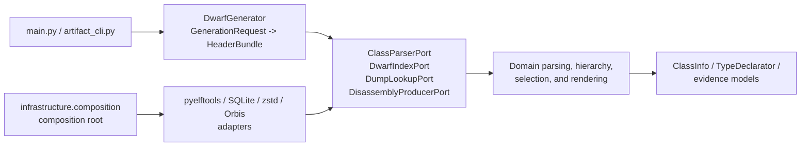

# Component Diagram

Complete class structure diagram showing all components in the DWARF-to-C++ header reconstructor.

```mermaid
classDiagram
    %% Application Layer
    class DwarfGenerator {
        -Path elf_path
        -LazyDwarfIndexService lazy_index
        -LazyTypeResolver type_resolver
        -ClassParser class_parser
        -HeaderGenerator header_generator
        -HierarchyBuilder hierarchy_builder
        +__init__(elf_path: Path)
        +generate_header(class_name: str, include_metadata: bool) str
        +generate_complete_hierarchy_header(class_name: str, include_metadata: bool) str
        +generate_multi_file_hierarchy(class_name: str, output_dir: Path) dict~str,str~
        +find_class(name: str) tuple~CompileUnit, DIE~
        -_expand_typedef_search(full_hierarchy: bool)
        -_build_hierarchy_with_timing(class_name: str, max_depth: int) tuple
        -_validate_hierarchy(class_infos: dict, class_name: str) bool
        -_collect_typedefs_and_packing(class_infos: dict) dict~str,str~
        +close()
    }

    %% Domain Layer - Models
    class ClassInfo {
        +str name
        +int byte_size
        +list~MemberInfo~ members
        +list~MethodInfo~ methods
        +list~str~ base_classes
        +list~EnumInfo~ enums
        +list~StructInfo~ nested_structs
        +list~UnionInfo~ unions
        +int|None alignment
        +str|None declaration_file
        +int|None declaration_line
        +int|None die_offset
        +dict|None packing_info
        +list~TemplateTypeParam~ template_type_params
        +list~TemplateValueParam~ template_value_params
    }

    class MemberInfo {
        +str name
        +str type
        +int byte_offset
        +int|None bit_size
        +int|None bit_offset
        +int|None type_offset
    }

    class MethodInfo {
        +str name
        +str return_type
        +list~ParameterInfo~ parameters
        +bool is_virtual
        +bool is_static
        +bool is_const
        +int|None vtable_index
        +int|None return_type_offset
    }

    class EnumInfo {
        +str name
        +str type
        +dict~str,int~ enumerators
    }

    class StructInfo {
        +str name
        +int byte_size
        +list~MemberInfo~ members
    }

    class UnionInfo {
        +str name
        +int byte_size
        +list~MemberInfo~ members
    }

    %% Domain Layer - Services (Parsing)
    class ClassParser {
        -LazyTypeResolver type_resolver
        -LazyDwarfIndexService dwarf_index
        +__init__(type_resolver, dwarf_index)
        +find_class(name: str) tuple~CompileUnit, DIE~|None
        +parse_class_info(cu: CompileUnit, die: DIE) ClassInfo
        -_parse_members(class_die: DIE) list~MemberInfo~
        -_parse_methods(class_die: DIE) list~MethodInfo~
        -_parse_nested_types(class_die: DIE)
    }

    class DIETypeClassifier {
        <<static>>
        +is_class_type(die: DIE) bool
        +is_enum_type(die: DIE) bool
        +is_struct_type(die: DIE) bool
        +is_union_type(die: DIE) bool
        +is_forward_declaration(die: DIE) bool
        +is_namespace(die: DIE) bool
        +should_resolve_as_dependency(die: DIE) bool
    }

    %% Domain Layer - Services (Generation)
    class HeaderGenerator {
        -LazyDwarfIndexService dwarf_index
        +__init__(dwarf_index)
        +generate_header(class_info, typedefs, cu_offset) str
        +generate_single_file_hierarchy_header(class_infos, hierarchy_order, target_class, typedefs) str
        +generate_multi_file_hierarchy(classes_by_file, all_typedefs, class_infos) dict~str,str~
        -_generate_forward_declarations(class_infos, hierarchy_order) str
        -_generate_class_definition(class_info) str
        -_generate_members(members) str
        -_generate_methods(methods) str
        -_generate_enum(enum_info) str
        -_generate_struct(struct_info) str
        -_generate_union(union_info) str
    }

    class HierarchyBuilder {
        -ClassParser class_parser
        -LazyDwarfIndexService dwarf_index
        -DependencyExtractor dependency_extractor
        +__init__(class_parser, dwarf_index)
        +build_full_hierarchy(class_name) tuple~dict, list~
        +build_full_hierarchy_with_dependencies(class_name, max_depth) tuple~dict, list~
        -_find_base_class(class_die) str|None
        -_process_dependencies_offset_based(class_infos, max_depth) dict~str, ClassInfo~
    }

    class DependencyExtractor {
        -LazyDwarfIndexService dwarf_index
        +__init__(dwarf_index)
        +extract_dependencies(class_info) set~int~
        +filter_resolvable_types(offsets) set~int~
        -_get_member_type_offset(member) int|None
        -_get_method_return_type_offset(method) int|None
        -_get_parameter_type_offset(param) int|None
        -_extract_struct_dependencies(struct, deps)
        -_extract_union_dependencies(union, deps)
    }

    class FileRegistry {
        -DWARFInfo dwarf_info
        -dict~str,list~ _file_to_classes
        +__init__(dwarf_info)
        +register_class(class_name, cu_offset, decl_file)
        +get_classes_by_file() dict~str,list~
        -_normalize_path(path) str
    }

    %% Parsing Domain
    class LazyTypeResolver {
        -DWARFInfo dwarf_info
        -LazyDwarfIndexService dwarf_index
        -dict~int,str~ _type_cache
        -set~int~ PRIMITIVE_TYPEDEFS
        +__init__(dwarf_info, dwarf_index)
        +resolve_type(die: DIE) str|None
        +resolve_type_from_offset(offset: int) str|None
        +discover_typedefs() dict~str,str~
        +collect_used_typedefs(members, methods, base_classes, enums, structs, unions) dict~str,str~
        -_resolve_type_chain(die, visited) str|None
        -_format_pointer_type(base_type, qualifiers) str
        -_format_array_type(die, base_type) str
    }

    class LazyDwarfIndexService {
        -DWARFInfo dwarf_info
        -dict~int,DIE~ _offset_index
        -bool _index_built
        +__init__(dwarf_info, cache_file, die_cache_size)
        +get_die_by_offset(offset: int) DIE|None
        +extract_die_by_offset(offset: int) DIE|None
        +targeted_symbol_search(symbol_name, timeout) int|None
        +save_cache()
        +load_cache()
        -_build_offset_index()
        -_index_dies_in_cu(cu)
    }

    %% Infrastructure Layer
    class PersistentSymbolCache {
        -Path cache_dir
        -dict~str,Any~ _memory_cache
        -int max_memory_size
        +__init__(cache_dir, max_memory_size)
        +get(symbol_name: str) ClassInfo|None
        +put(symbol_name: str, class_info: ClassInfo)
        +clear()
        +get_stats() dict
        -_get_cache_path(symbol_name) Path
        -_serialize(class_info) bytes
        -_deserialize(data) ClassInfo
    }

    class AtomicHeaderPublisher {
        +publish(output_dir, platform, headers) tuple~Path,int~
        -stage_headers(headers)
        -commit_manifest()
        -rollback()
    }

    class PackingAnalyzer {
        <<static>>
        +calculate_packing_info(class_info: ClassInfo) dict~str,int~
        -_calculate_padding(members, byte_size) int
        -_calculate_alignment(members) int
        -_infer_packing(members) int
    }

    class DwarfRuntimeConfig {
        <<dataclass>>
        +int die_cache_size
        +int type_cache_size
        +float search_timeout_seconds
    }

    %% Relationships - Application Layer
    DwarfGenerator --> ClassParser : uses
    DwarfGenerator --> HeaderGenerator : uses
    DwarfGenerator --> HierarchyBuilder : uses
    DwarfGenerator --> LazyTypeResolver : uses
    DwarfGenerator --> LazyDwarfIndexService : uses

    %% Relationships - Domain Models
    ClassInfo *-- MemberInfo : contains
    ClassInfo *-- MethodInfo : contains
    ClassInfo *-- EnumInfo : contains
    ClassInfo *-- StructInfo : contains
    ClassInfo *-- UnionInfo : contains
    MethodInfo *-- MemberInfo : parameters

    %% Relationships - Parsing Services
    ClassParser --> LazyTypeResolver : resolves types
    ClassParser --> LazyDwarfIndexService : finds DIEs
    ClassParser --> ClassInfo : creates
    ClassParser --> DIETypeClassifier : validates types

    %% Relationships - Generation Services
    HeaderGenerator --> LazyDwarfIndexService : validates offsets
    HeaderGenerator --> DIETypeClassifier : filters types
    HeaderGenerator --> ClassInfo : reads
    AtomicHeaderPublisher --> HeaderGenerator : publishes output

    HierarchyBuilder --> ClassParser : parses classes
    HierarchyBuilder --> DependencyExtractor : extracts dependencies
    HierarchyBuilder --> LazyDwarfIndexService : resolves offsets
    HierarchyBuilder --> ClassInfo : builds

    DependencyExtractor --> LazyDwarfIndexService : resolves offsets
    DependencyExtractor --> DIETypeClassifier : classifies types
    DependencyExtractor --> ClassInfo : reads

    FileRegistry --> LazyDwarfIndexService : extracts file paths
    FileRegistry --> ClassInfo : organizes

    %% Relationships - Core Services
    LazyTypeResolver --> LazyDwarfIndexService : finds DIEs
    LazyTypeResolver --> PersistentSymbolCache : caches types

    %% Relationships - Infrastructure
    DwarfGenerator --> PersistentSymbolCache : caches symbols
    DwarfGenerator --> PackingAnalyzer : analyzes packing
    DwarfGenerator --> DwarfRuntimeConfig : configured by

    %% Notes
    note for DwarfGenerator "Application Layer\nOrchestrates parsing and generation"
    note for ClassParser "Domain Layer\nParses DWARF DIEs into ClassInfo"
    note for HeaderGenerator "Domain Layer\nGenerates C++ headers for single and multi-file modes"
    note for HierarchyBuilder "Domain Layer\nBuilds inheritance chains and resolves dependencies recursively"
    note for LazyTypeResolver "Parsing Domain\nOn-demand type resolution with caching"
    note for LazyDwarfIndexService "Core Layer\nEfficient DIE offset lookup (O(1) after index)"
```

## Component Responsibilities

### Application Layer
- **DwarfGenerator**: Main orchestrator coordinating all components through an injected session lifecycle, provides public API

### Domain Layer - Models
- **ClassInfo**: Complete class representation with members, methods, inheritance
- **MemberInfo**: Member variable with type, offset, bitfield information
- **MethodInfo**: Method signature with parameters, virtual table info
- **EnumInfo**, **StructInfo**, **UnionInfo**: Nested type definitions

### Domain Layer - Parsing Services
- **ClassParser**: DWARF DIE → ClassInfo conversion with multi-CU resolution
- **DIETypeClassifier**: Static utilities for type validation and classification

### Domain Layer - Generation Services
- **HeaderGenerator**: ClassInfo → C++ header generation (single-file and multi-file modes)
- **HierarchyBuilder**: Builds complete inheritance chains with dependency resolution
- **DependencyExtractor**: Offset-based dependency extraction without string parsing
- **FileRegistry**: Organizes classes by original source files using DW_AT_decl_file

### Parsing and Index Services
- **LazyTypeResolver**: Parsing-domain type resolution with LRU caching and typedef collection
- **LazyDwarfIndexService**: O(1) DIE offset lookup with lazy index building and persistent caching

### Infrastructure Layer
- **PersistentSymbolCache**: Disk-based symbol caching with LRU memory cache
- **AtomicHeaderPublisher**: staged, manifest-backed header publication with rollback
- **PackingAnalyzer**: Struct packing and alignment analysis
- **DwarfRuntimeConfig**: Validated cache sizes and bounded search timeout

## References

- [ARCHITECTURE.md](ARCHITECTURE.md) - Detailed architecture documentation
- [GENERATION_FLOWS.md](GENERATION_FLOWS.md) - Generation workflow diagrams
- [README.md](../README.md) - Project overview and usage

## Hexagonal composition

The diagram's domain services communicate through narrow ports. The runtime
composition is:

Only the composition root constructs concrete adapters. This keeps source
identity, candidate scoring, method evidence, type classification, and header
rendering testable without process, filesystem, SQLite, zstd, or proprietary
SDK dependencies.
