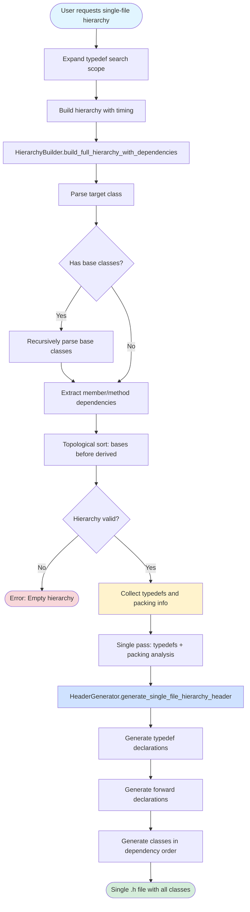
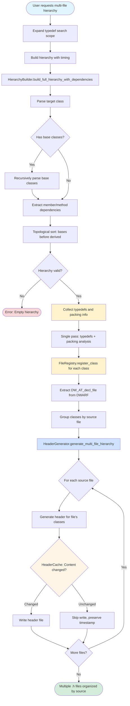
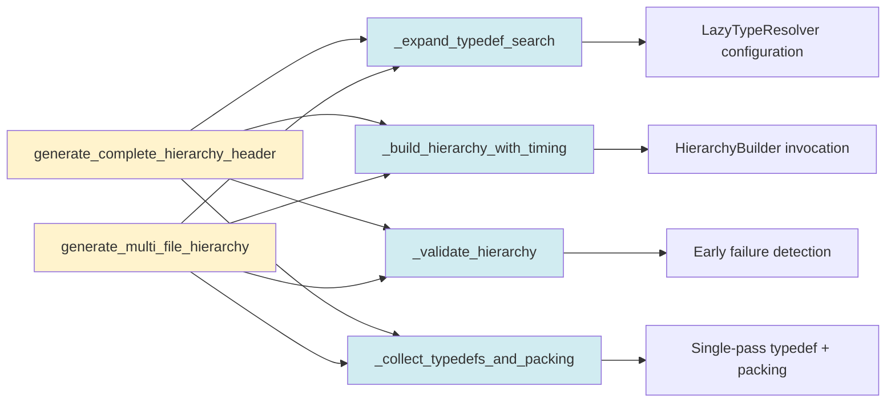
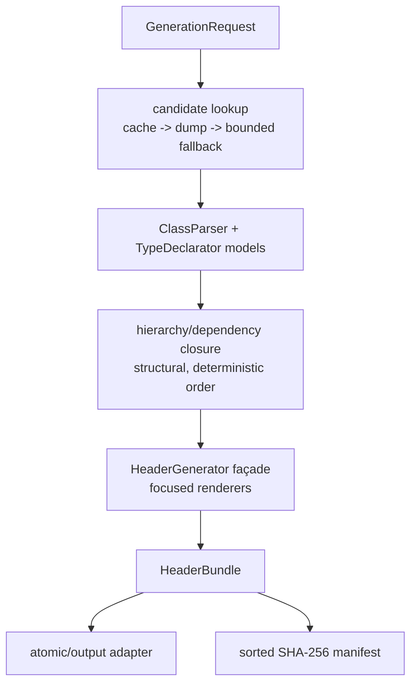

# Generation Workflows

Visual flowcharts showing the step-by-step processes for single-file and multi-file header generation modes.

## Single-File Generation Flow

Complete inheritance hierarchy in one monolithic header file.



### Key Steps

1. **Expand typedef search scope**: Configure LazyTypeResolver to search all CUs
2. **Build hierarchy**: Parse target class, walk inheritance chain, extract dependencies
3. **Topological sort**: Order classes so bases appear before derived classes
4. **Validate**: Ensure hierarchy contains at least one class
5. **Collect typedefs and packing**: Single pass through all classes for efficiency
6. **Generate header**: Create monolithic .h file with all classes in dependency order

### Output Example

```cpp
#ifndef RLAYOUT_HIERARCHY_H
#define RLAYOUT_HIERARCHY_H

// Typedefs (52 total)
typedef unsigned int u32;
typedef int s32;

// Forward declarations
class MtString;

// Classes in dependency order
class MtObject { /* 8 bytes */ };
class cResource : public MtObject { /* 112 bytes */ };
class rLayout : public cResource { /* 528 bytes */ };

#endif
```

## Multi-File Generation Flow

Hierarchy organized by original source files.



### Key Steps

1. **Expand typedef search scope**: Configure LazyTypeResolver to search all CUs
2. **Build hierarchy**: Parse target class, walk inheritance chain, extract dependencies
3. **Topological sort**: Order classes so bases appear before derived classes
4. **Validate**: Ensure hierarchy contains at least one class
5. **Collect typedefs and packing**: Single pass through all classes for efficiency
6. **FileRegistry**: Extract DW_AT_decl_file attribute, group classes by source file
7. **Generate headers**: Create separate .h file for each source file
8. **HeaderCache**: Check SHA256 hash, only write files that changed
9. **Preserve timestamps**: Unchanged files keep original timestamps (helps build systems)

### Output Example

```
output/ps4/
├── MtObject.h        (base class)
├── cResource.h       (intermediate class)
└── rLayout.h         (target class)
```

## Shared Helper Methods

Both generation modes use identical helper methods in `DwarfGenerator`:



### Helper Method Details

#### `_expand_typedef_search(full_hierarchy: bool)`
Configures LazyTypeResolver to search all compilation units for typedefs. Required for hierarchy mode because dependencies may use typedefs defined in different CUs.

#### `_build_hierarchy_with_timing(class_name: str, max_depth: int = 10)`
Wraps HierarchyBuilder invocation with timing instrumentation. Returns `(class_infos dict, hierarchy_order list)`.

#### `_validate_hierarchy(class_infos: dict, class_name: str) -> bool`
Checks if hierarchy contains any classes. Early failure detection prevents downstream errors in generation phase.

#### `_collect_typedefs_and_packing(class_infos: dict) -> dict[str, str]`
Single-pass iteration through all classes to:
1. Collect typedefs using LazyTypeResolver
2. Compute packing information using PackingAnalyzer

Reduces complexity from O(2n) to O(n).

### Rationale for Shared Helpers

**Problem:** Both modes originally contained ~75% duplicate code for hierarchy building, validation, and typedef collection.

**Solution:** Extract shared operations into reusable helper methods.

**Benefits:**
- Bug fixes automatically apply to both modes
- Mode-specific differences clearly isolated (FileRegistry, output format)
- Independent testing of each step
- Code duplication reduced from ~75% to ~15%

## Data Flow Comparison

| Step | Single-File Mode | Multi-File Mode |
|------|------------------|-----------------|
| 1. Configure | Expand typedef search | Expand typedef search |
| 2. Parse | Build hierarchy with timing | Build hierarchy with timing |
| 3. Validate | Check non-empty hierarchy | Check non-empty hierarchy |
| 4. Collect | Typedefs + packing (single pass) | Typedefs + packing (single pass) |
| 5. Organize | N/A | FileRegistry groups by source file |
| 6. Generate | Single monolithic header | One header per source file |
| 7. Cache | N/A | HeaderCache checks for changes |
| 8. Output | Write single .h file | Write only changed files |

## Performance Characteristics

| Operation | Single-File | Multi-File | Notes |
|-----------|-------------|------------|-------|
| Hierarchy building | 4.6s | 4.6s | Same algorithm, same performance |
| Typedef collection | 0.042s | 0.042s | Single pass in both modes |
| Header generation | 0.1s | 0.3s | Multi-file slower (more I/O) |
| Disk writes | Always | Selective | HeaderCache avoids unnecessary writes |
| Output size | 341KB (1 file) | 341KB (many files) | Same total size, different organization |

## Use Cases

### Single-File Mode
- **Reverse engineering**: Quick analysis, all dependencies visible
- **Small projects**: Simple structure, easy to navigate
- **Documentation**: Self-contained header for reference
- **Debugging**: All classes in one place

### Multi-File Mode
- **Large codebases**: Matches original project organization
- **IDE integration**: Jump to definition works correctly
- **Build systems**: Timestamps preserved, only changed files recompiled
- **Modular development**: Classes organized by functional area

## References

- [ARCHITECTURE.md](ARCHITECTURE.md) - Detailed architecture documentation
- [COMPONENT_DIAGRAM.md](COMPONENT_DIAGRAM.md) - Class structure diagram
- [TESTING.md](TESTING.md) - Testing strategy
- [README.md](../README.md) - Usage examples

## Typed workflow and regression sequence

Both modes now enter through `GenerationRequest` and return a deterministic
`HeaderBundle`. The shared workflow is:



After source changes, run the unit/static tier, then the non-performance
coverage tier and `check_coverage.py`. The fixture acceptance run compares the
five retained legacy single-file headers byte-for-byte. The compatibility
`python main.py` and canonical console entrypoints are compared with the same
manifest. The explicit real PS4 run uses the external ELF, compressed dump, and
validated SQLite sidecar; fresh-process warm reruns must reproduce the same
header manifest.

The sidecar is built by one bounded-memory zstd pass and published atomically.
Its cold rebuild is opt-in and resource-heavy; normal generation must reuse the
validated sidecar and source-bound symbol cache.
