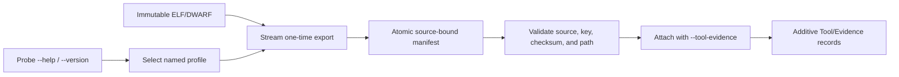
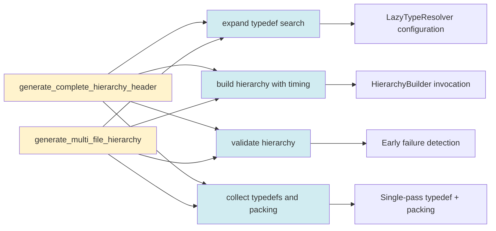
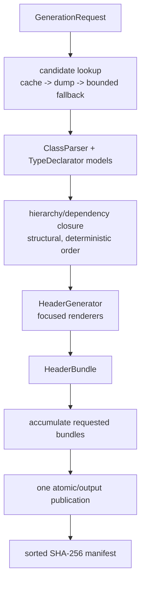

# Generation Workflows

Visual flowcharts showing the step-by-step processes for single-file and multi-file header generation modes.

## Single-File Generation Flow

Complete inheritance hierarchy in one monolithic header file.


### Key Steps

1. **Expand typedef search scope**: Configure LazyTypeResolver to search all CUs
2. **Build hierarchy**: Parse target class, walk inheritance chain, extract dependencies
3. **Topological sort**: Order classes so bases appear before derived classes
4. **Validate**: Ensure hierarchy contains at least one class
5. **Collect typedefs and packing**: Single pass through all classes for efficiency
6. **Generate header**: Create monolithic .h file with all classes in dependency order

### Output Example

```cpp
#ifndef RLAYOUT_HIERARCHY_H
#define RLAYOUT_HIERARCHY_H

// Typedefs (52 total)
typedef unsigned int u32;
typedef int s32;

// Forward declarations
class MtString;

// Classes in dependency order
class MtObject { /* 8 bytes */ };
class cResource : public MtObject { /* 112 bytes */ };
class rLayout : public cResource { /* 528 bytes */ };

#endif
```

## Multi-File Generation Flow

Hierarchy organized by original source files.

```mermaid
flowchart TD
    Start([User requests multi-file hierarchy]) --> Expand[Expand typedef search scope]
    Expand --> Build[Build hierarchy with timing]
    Build --> BuildHier[HierarchyBuilder.build_full_hierarchy_with_dependencies]
    BuildHier --> Parse[Parse target class]
    Parse --> BaseClasses{Has base classes?}
    BaseClasses -->|Yes| ParseBases[Recursively parse base classes]
    ParseBases --> ExtractDeps
    BaseClasses -->|No| ExtractDeps[Extract member/method dependencies]
    ExtractDeps --> TopoSort[Topological sort: bases before derived]
    TopoSort --> Validate{Hierarchy valid?}
    Validate -->|No| Error([Error: Empty hierarchy])
    Validate -->|Yes| Collect[Collect typedefs and packing info]
    Collect --> SinglePass[Single pass: typedefs + packing analysis]
    SinglePass --> Registry[FileRegistry.register_class for each class]
    Registry --> ExtractFile[Extract DW_AT_decl_file from DWARF]
    ExtractFile --> GroupFiles[Group classes by source file]
    GroupFiles --> GenMulti[HeaderGenerator.generate_multi_file_hierarchy]
    GenMulti --> ForEachFile{For each source file}
    ForEachFile --> GenFileHeader[Generate header for file's classes]
    GenFileHeader --> StageBundle[AtomicHeaderPublisher stages headers]
    StageBundle --> CommitBundle{Commit succeeds?}
    CommitBundle -->|Yes| WriteFile[Commit header files and manifest]
    CommitBundle -->|No| Rollback[Restore previous bundle]
    WriteFile --> NextFile{More files?}
    Rollback --> NextFile
    NextFile -->|Yes| ForEachFile
    NextFile -->|No| Output([Multiple .h files organized by source])
    
    style Start fill:#e1f5ff
    style Output fill:#d4edda
    style Error fill:#f8d7da
    style Collect fill:#fff3cd
    style Registry fill:#fff3cd
    style GenMulti fill:#cfe2ff
    style CheckCache fill:#fef5e7
```



### Key Steps

1. **Expand typedef search scope**: Configure LazyTypeResolver to search all CUs
2. **Build hierarchy**: Parse target class, walk inheritance chain, extract dependencies
3. **Topological sort**: Order classes so bases appear before derived classes
4. **Validate**: Ensure hierarchy contains at least one class
5. **Collect typedefs and packing**: Single pass through all classes for efficiency
6. **FileRegistry**: Extract DW_AT_decl_file attribute, group classes by source file
7. **Generate headers**: Create separate .h file for each source file
8. **AtomicHeaderPublisher**: Stage UTF-8 files, validate names, and calculate SHA-256 records
9. **Commit manifest**: Publish the bundle or roll back all targets when a write fails

### Output Example

```
output/ps4/
├── MtObject.h        (base class)
├── cResource.h       (intermediate class)
└── rLayout.h         (target class)
```

## Observability checkpoints

The same stages are visible in both generation modes. The CLI binds a `run_id`,
command, input/output paths, and per-symbol context. The JSONL record sequence
is intentionally sparse:

```text
logging_initialized
generation_options
symbol_started
  -> dwarf_search_started / cache or dump events
  -> hierarchy_build_completed / header_render_completed
  -> headers_published
symbol_completed | symbol_failed
generation_summary
```

Search and artifact adapters add counts, offsets, cache state, source identity,
and `duration_ms`; they do not emit one record per DIE or line. A warning means
the operation returned an incomplete, unavailable, stale, or recovered result.
An error includes the chained exception and should be investigated from the
JSONL record before changing parser policy. See [OBSERVABILITY.md](OBSERVABILITY.md)
for field and severity rules.

## Optional external evidence flow

Toolchain exports happen before knowledge export and are never part of ordinary header generation:



The export command is bounded by a timeout and bounded diagnostic/help captures; raw profile
output is streamed to disk. `ToolchainExporter` reuses the source identity catalog and rejects
stale or incomplete manifests. Orbis profiles carry PS4 ABI authority, while LLVM/GNU/elfutils/
libdwarf profiles carry cross-check authority. pyelftools remains the in-process structured parser;
LIEF and OpenOrbis are comparison references until PS4-specific behavior is validated. `elfldr`
is not an offline ingestion or execution dependency.

## Shared workflow services

Both generation modes use the same operations through the composed `GeneratorWorkflow`:



### Workflow operation details

#### Expand typedef search
Configures LazyTypeResolver to search all compilation units for typedefs. Required for hierarchy mode because dependencies may use typedefs defined in different CUs.

#### Build hierarchy with timing
Wraps HierarchyBuilder invocation with timing instrumentation. Returns `(class_infos dict, hierarchy_order list)`.

#### Validate hierarchy
Checks if hierarchy contains any classes. Early failure detection prevents downstream errors in generation phase.

#### Collect typedefs and packing
Single-pass iteration through all classes to:
1. Collect typedefs using LazyTypeResolver
2. Compute packing information using PackingAnalyzer

Reduces complexity from O(2n) to O(n).

### Rationale for Workflow Composition

**Problem:** Both modes need the same hierarchy, validation, and typedef policies.

**Solution:** Compose one workflow from typed operation services.

**Benefits:**
- Bug fixes automatically apply to both modes
- Mode-specific differences clearly isolated (FileRegistry, output format)
- Independent testing of each step
- Code duplication reduced from ~75% to ~15%

## Data Flow Comparison

| Step | Single-File Mode | Multi-File Mode |
|------|------------------|-----------------|
| 1. Configure | Expand typedef search | Expand typedef search |
| 2. Parse | Build hierarchy with timing | Build hierarchy with timing |
| 3. Validate | Check non-empty hierarchy | Check non-empty hierarchy |
| 4. Collect | Typedefs + packing (single pass) | Typedefs + packing (single pass) |
| 5. Organize | N/A | FileRegistry groups by source file |
| 6. Generate | Single monolithic header | One header per source file |
| 7. Publish | Atomic bundle commit | Atomic bundle commit with manifest |
| 8. Output | One committed .h file | Committed per-file bundle |

## Performance Characteristics

| Operation | Single-File | Multi-File | Notes |
|-----------|-------------|------------|-------|
| Hierarchy building | 4.6s | 4.6s | Same algorithm, same performance |
| Typedef collection | 0.042s | 0.042s | Single pass in both modes |
| Header generation | 0.1s | 0.3s | Multi-file slower (more I/O) |
| Disk writes | One atomic commit | One atomic bundle commit |
| Output size | 341KB (1 file) | 341KB (many files) | Same total size, different organization |

## Use Cases

### Single-File Mode
- **Reverse engineering**: Quick analysis, all dependencies visible
- **Small projects**: Simple structure, easy to navigate
- **Documentation**: Self-contained header for reference
- **Debugging**: All classes in one place

### Multi-File Mode
- **Large codebases**: Matches original project organization
- **IDE integration**: Jump to definition works correctly
- **Build systems**: Timestamps preserved, only changed files recompiled
- **Modular development**: Classes organized by functional area

## References

- [ARCHITECTURE.md](ARCHITECTURE.md) - Detailed architecture documentation
- [COMPONENT_DIAGRAM.md](COMPONENT_DIAGRAM.md) - Class structure diagram
- [TESTING.md](TESTING.md) - Testing strategy
- [README.md](../README.md) - Usage examples

## Typed workflow and regression sequence

Both modes now enter through `GenerationRequest` and return a deterministic
`HeaderBundle`. The shared workflow is:



After source changes, run the unit/static tier, then the required correctness tier (including
deterministic integration tests) and `uv run python -m tests.support.quality.check_coverage`. The fixture acceptance run compares the
five retained single-file headers byte-for-byte. The packaged console entrypoint
is compared across the intentional output modes with the same manifest. The
explicit real PS4 run uses the external ELF, compressed dump, and
validated SQLite sidecar; fresh-process warm reruns must reproduce the same
header manifest.

Before changing parser relationships, run the explicit evidence surfaces:

```text
uv run ddon-dwarf-reconstructor artifacts inspect-elf <PS4-ELF>
uv run ddon-dwarf-reconstructor artifacts inspect-dwarf-dump <LLVM-DWARF-DUMP.zst>
uv run --project tools/dwarf_spec_pipeline dwarf-spec-pipeline audit \
  --output-dir docs/knowledge-base/dwarf-specification/generated --source-root src
```

The ELF inspection verifies every CU header and producer. The compressed-dump inspection streams
the LLVM text and retains only version/producer counters. The specification audit supplies the
versioned tag, attribute, form, operation, encoding, and applicability index used when reviewing
parser assumptions.

For a repeated-symbol CLI invocation, the application accumulates successful
header bundles and publishes them once. This is required because the atomic
publisher removes files absent from the incoming manifest; publishing after
each symbol would otherwise make the last symbol replace the earlier results.

The sidecar is built by one bounded-memory zstd pass and published atomically.
Its cold rebuild is opt-in and resource-heavy; normal generation must reuse the
validated sidecar and source-bound symbol cache.
