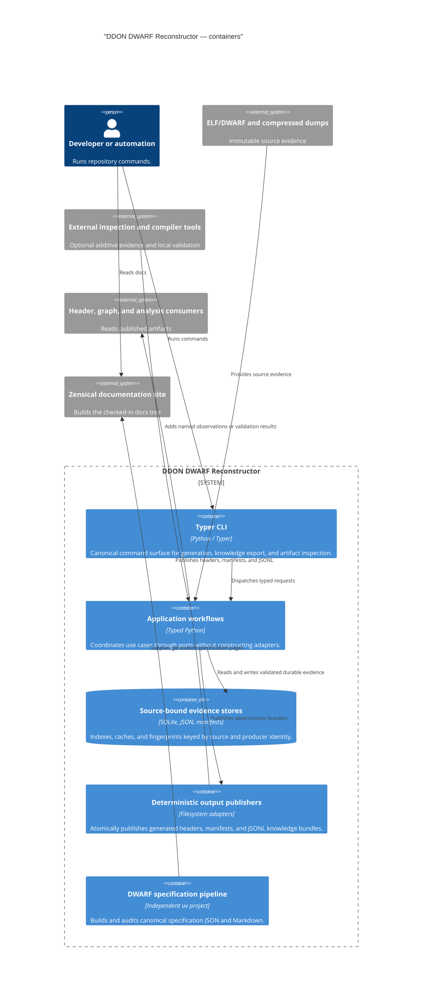
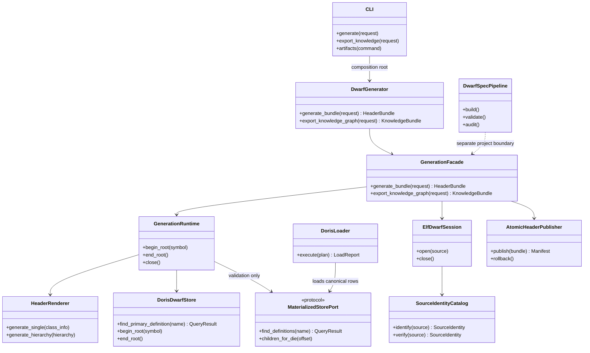

# Containers and building blocks

The repository has two independently locked Python projects and several non-Python boundaries.
The C4 container view shows the deployable or independently replaceable responsibilities; it is
not intended to mirror every Python package.

The repository also keeps a UML-style building-block view because the C4 diagram intentionally
omits implementation-level method contracts:

The `core` package contains technology-neutral contracts and observability/path boundaries.
`domain` owns evidence models, parsing policy, type/declarator logic, and generation policy.
`application` coordinates use cases through ports. `infrastructure` implements ELF/DWARF,
SQLite, zstd, filesystem, external-tool, configuration, and logging adapters.

The graph exporter is an application projection over the same producer facts. It must not become
a second definition-selection or evidence-authority implementation.
