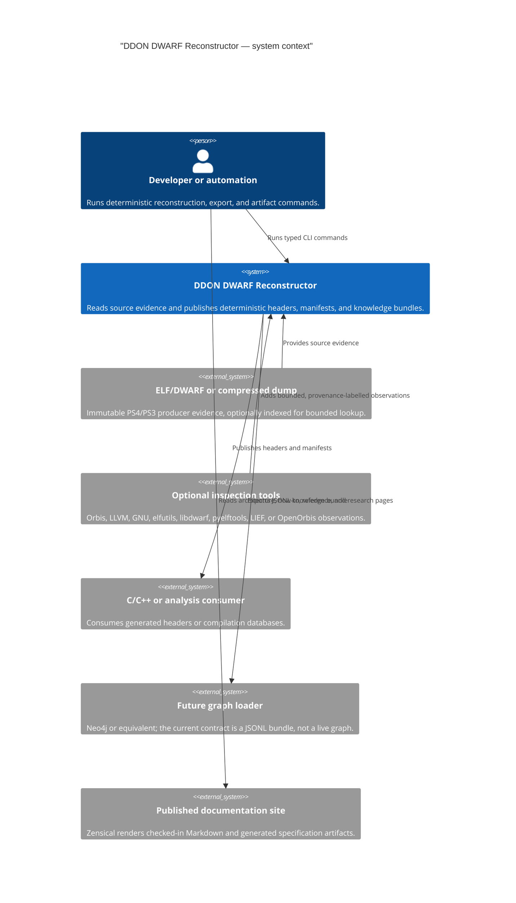
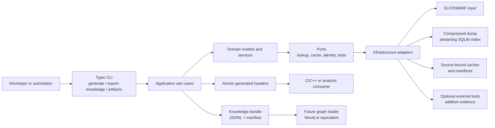

# System context

The following C4 system-context view deliberately stays at the repository boundary. It answers
who uses the system and which external inputs and consumers matter; it is not a module inventory.

Mermaid's C4 syntax is experimental. This view therefore communicates stable system semantics,
while the repository's native flowcharts, sequence diagrams, and UML class diagrams remain the
fallback when a reader needs a view that C4 does not express well.

The reconstructor consumes immutable ELF/DWARF or bounded compressed-dump inputs and produces
deterministic headers, manifests, and graph-shaped knowledge bundles. External tools are optional
evidence producers, not hidden dependencies of the offline path.

The site is a separate publication consumer of checked-in Markdown and generated DWARF
specification artifacts. It does not sit in the reconstruction runtime path.
