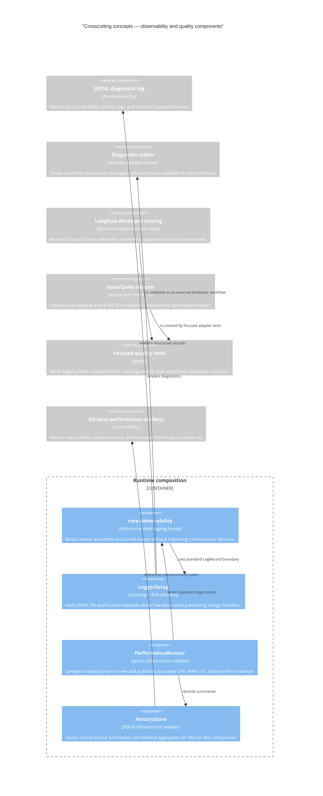
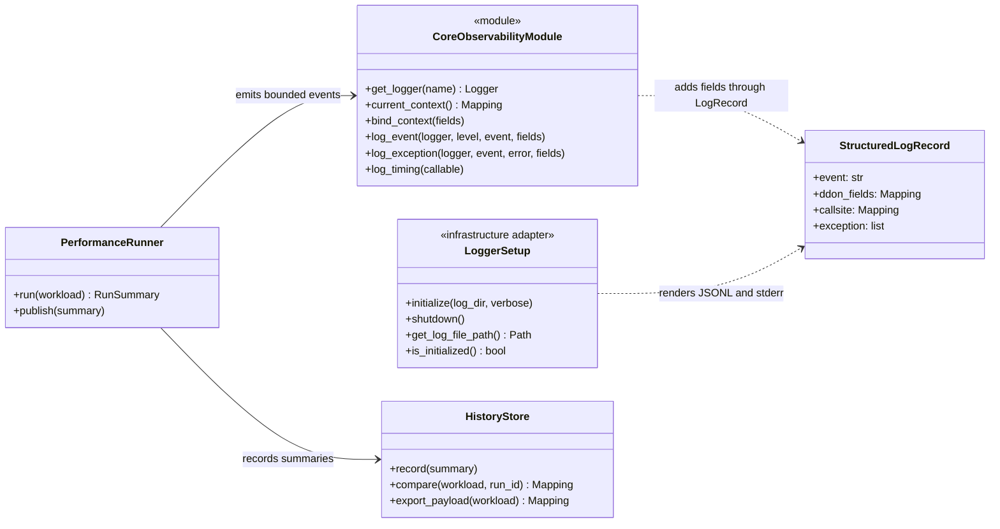
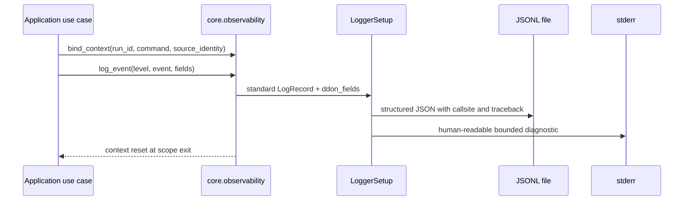

# Crosscutting concepts

This page is the repository's arc42 section-8 home. It documents the few policies that recur
across multiple building blocks: observability, durable evidence, authority and provenance,
validation, and documentation publication. It explains how those policies work, links them to
source and tests, and routes task-oriented readers to the relevant how-to pages.

arc42 section 8 is intentionally selective: it is a central specification of important recurring
approaches, not a catalogue of every helper or framework option. The [application logging
how-to](../../how-to/observability.md), [Langfuse how-to](../../how-to/observability/langfuse.md),
and [SonarQube how-to](../../how-to/quality/sonarqube.md) contain the operational procedures.

## Concept map

The C4 component view identifies the implementation surfaces that carry these policies. It keeps
runtime logging, optional external telemetry, and local quality analysis distinct: only the first
two logging components are in the runtime application path, while Langfuse and SonarQube are
developer tooling adapters.

Mermaid's C4 syntax is experimental and its layout is order-sensitive. The diagram is therefore a
semantic map, not a build-time contract. The native UML and sequence diagrams below are the stable
code-oriented views for the logging boundary.

## Observability boundary

### Policy

Core and application code use the standard-library logging facade from
[`core.observability`](../../../src/ddon_dwarf_reconstructor/core/observability.py). They must not
import `structlog`, Rich, OpenTelemetry, or a concrete telemetry vendor. The infrastructure
composition root installs [`LoggerSetup`](../../../src/ddon_dwarf_reconstructor/infrastructure/logging/logger_setup.py),
which owns rendering and handlers.

Every run should bind bounded context at a useful boundary: `run_id`, command, source path or
identity, symbol, stage, and optional trace/span identifiers. Event names are stable snake_case
values. Use debug for bounded hot-loop detail, info for stage boundaries, warning for incomplete or
recoverable evidence, and error for failed operations. Never log ELF/DWARF bytes, complete
generated headers, credentials, every DIE, or unbounded subprocess output.

### Contract view

This UML view distinguishes the technology-neutral facade from the infrastructure adapter:

The boundary is exercised by
[`tests/infrastructure/test_logging.py`](../../../tests/infrastructure/test_logging.py). Those
tests verify scoped context, structured fields, callsite data, complete chained exceptions, and
preservation of handlers owned by callers. `LoggerSetup` writes one JSONL file per process under
the configured log directory and keeps diagnostics on stderr so artifact commands can reserve
stdout for JSON.

### Runtime sequence

Langfuse is intentionally outside this runtime sequence. The [Langfuse how-to](../../how-to/observability/langfuse.md)
configures Copilot and Codex directly; it does not add a vendor SDK to the reconstructor.

## Durable artifacts and identity

Source-bound state is a crosscutting correctness rule. [`SourceIdentityCatalog`](../../../src/ddon_dwarf_reconstructor/infrastructure/artifacts.py)
binds reusable indexes and caches to size, mtime, device, inode, the retained ctime mutation
signal, and a full SHA-256 when explicit verification is requested. A warm identity may be reused
only when metadata proves the same filesystem object; path-only or boundary-sampling identity is
not a valid shortcut.

Durable output is validated before reuse and published atomically by
[`AtomicHeaderPublisher`](../../../src/ddon_dwarf_reconstructor/infrastructure/header_output.py).
Generated headers, manifests, JSONL bundles, SQLite indexes, and external-tool exports are keyed by
source plus producer, schema, and configuration identity. Interrupted writes must leave the previous
valid bundle available.
The [durable artifacts reference](../../reference/artifacts.md) and
[artifact inspection how-to](../../how-to/inspect-artifacts.md) describe the operational contract.

## Evidence authority and provenance

Producer facts and derived observations have different authority:

| Evidence | Authority | Crosscutting rule |
| --- | --- | --- |
| Owning DWARF DIE | Producer fact | Preserve qualified names, inheritance, offsets, sizes, source locations, DIE/CU provenance, and deterministic order. |
| `DefinitionCandidate` selection | Reconstructor policy | Prefer complete definitions without silently converting declarations into behavior. |
| `SearchResult` | Bounded lookup contract | Preserve `complete`, `partial`, `not_found`, and `unavailable`; partial evidence is never complete evidence. |
| Orbis/LLVM/GNU/other tool export | Additive observation | Keep tool identity, command, version, manifest, and uncertainty; never overwrite producer facts. |
| SonarQube diagnostics | Local quality observation | Report compiler and database evidence separately from generated-header correctness. |
| JSONL knowledge bundle | Current projection | It is a deterministic export contract, not proof that a live LadybugDB loader exists. |

The [knowledge graph reference](../../reference/knowledge-graph.md),
[external-tool evidence record](../../knowledge-base/tools/external-tool-evidence.md), and
[LadybugDB import contract](https://github.com/ddon-research/ddon-dwarf-reconstructor/blob/main/specs/015-ladybugdb-knowledge-graph/contracts/import-contract.md)
are the details. Live graph ingestion remains a separately tracked task; this documentation slice
does not introduce a graph integration.

## Validation and quality analysis

The normal loop includes deterministic integration coverage. Environmental real-asset, performance,
packaging, compiler, and Sonar evidence are explicit tiers. The [testing reference](../../reference/testing.md)
and [testing knowledge base](../../knowledge-base/testing/testing-pyramid-and-validation-loop.md)
define marker and command policy.

## Boundary and completeness semantics

`GenerationFacade` and `GenerationRuntime` form the application boundary. The runtime receives
ready, typed collaborators from the composition root and owns one explicit resource scope. Domain
rendering depends on the immutable `HeaderRenderContext`; it does not construct a filesystem,
Doris, or compiler adapter.

The canonical analytical serving path is Doris. JSONL and Parquet are composed validation adapters
behind `MaterializedStorePort`; they are not substitutable storage subclasses. Definition
construction and ordering use the domain `DefinitionCandidate` policy in every adapter. Query
results retain provenance, truncation, diagnostics, and one of `complete`, `partial`, `not_found`,
or `unavailable`. A partial or unavailable result cannot be converted to a successful placeholder
header. A full-hierarchy request backed by a source-bound manifest rejects an unresolved
`UncategorizedDefinitions.h` bundle before atomic publication.

Doris publication is staged and verified by source-bound family counts. Stream Load distinguishes
`loaded`, `publish_pending`, and `failed`; a publish timeout remains incomplete until bounded
verification proves row-count parity. Request-scoped hydration caches are cleared at each root and
emit bounded size/hit/miss lifecycle events. Registry schema mismatches fail closed rather than
falling back to an unversioned compatibility shape.

Performance is a separate infrastructure boundary. `PerformanceRunner` samples only an explicit
child process, while `HistoryStore` writes the v1 ledger at `resources/performance/` and static
exports under the knowledge base. The normal generation path has no profiler hooks. See [Profile
the application](../../how-to/profile-performance.md) and the [performance reference](../../reference/performance.md).

SonarQube follows the same boundary. `tools.sonar.prepare_msvc_analysis` creates one standalone
translation unit per generated header, runs the required MSVC flags through the Build Wrapper, and
validates the resulting compilation database. The default strict exit code is acceptance evidence;
`--allow-validation-failure` is a deliberately weaker analysis-only mode. See
[Prepare local SonarQube C/C++ analysis](../../how-to/quality/sonarqube.md).

## Documentation as a crosscutting control

Documentation is maintained as a static, source-backed product:

- Tutorials teach one successful first experience.
- How-to guides solve one concrete developer problem and include prerequisites, commands, and
  verification.
- Reference pages state exact contracts and stable options.
- Explanation pages record arc42 architecture, reasons, trade-offs, and crosscutting concepts.
- Knowledge-base pages preserve research provenance and uncertainty.
- Specs are the roadmap and acceptance surface; they are not copied into prose as a second source
  of truth.

Architecture diagrams use C4 context/container/component/code levels only when each level adds
information. UML class diagrams show code contracts, sequence diagrams show a scenario, and
flowcharts show a pipeline or boundary. Every diagram is Mermaid source, has one stated question,
labels every important relationship, and is validated by `uv run just docs-check`.

## Concept-to-source matrix

| Concept | Primary implementation | Focused evidence | Task-oriented entry point |
| --- | --- | --- | --- |
| Logging boundary | `core/observability.py`, `infrastructure/logging/logger_setup.py` | `tests/infrastructure/test_logging.py` | [Application logging](../../how-to/observability.md) |
| Opt-in performance evidence | `infrastructure/performance/runner.py`, `infrastructure/performance/history.py` | performance runner/history tests and explicit fixture tier | [Profile the application](../../how-to/profile-performance.md) |
| Local developer tracing | `ops/langfuse/compose.yaml`, `justfile` | compose config and manual trace verification | [Langfuse](../../how-to/observability/langfuse.md) |
| MSVC/Sonar evidence | `tools/sonar/prepare_msvc_analysis.py` | `tests/tools/sonar/test_prepare_msvc_analysis.py` | [SonarQube](../../how-to/quality/sonarqube.md) |
| Source-bound publication | [`SourceIdentityCatalog`](../../../src/ddon_dwarf_reconstructor/infrastructure/artifacts.py), [`AtomicHeaderPublisher`](../../../src/ddon_dwarf_reconstructor/infrastructure/header_output.py) | artifact and determinism tests | [Durable artifacts](../../how-to/inspect-artifacts.md) |
| Documentation publication | `zensical.toml`, `.github/workflows/docs.yml`, `justfile` | strict site build and Pages deployment | [Write documentation](../../how-to/write-documentation.md) |

## Scan result and deliberate boundaries

The incremental source scan covered the CLI/application/domain/infrastructure paths, observability
modules and tests, Sonar adapter and tests, Langfuse compose and recipes, documentation navigation,
README/instruction adapters, active specs, and the Pages workflow. The formerly separate Langfuse
and SonarQube pages are now task-oriented entries, and the architecture policy has one section-8
home. No stale navigation or active-document links to the retired flat pages should remain.

The following are intentional boundaries rather than undocumented gaps:

- The Python application has no Langfuse SDK instrumentation; only Copilot and Codex developer
  clients export traces.
- SonarQube is local, optional, and additive; it is not a CI correctness gate.
- The LadybugDB-first knowledge graph loader remains deferred to `KG-001`; current exports are
  JSONL plus manifest.
- The C4 views stop at context, container, and component levels because finer diagrams would repeat
  the package inventory without adding a reader decision; native UML/sequence views cover the code
  and runtime questions.

If any of these boundaries change, update this page, the affected how-to, the active feature spec,
and the relevant source-linked tests in the same change.
