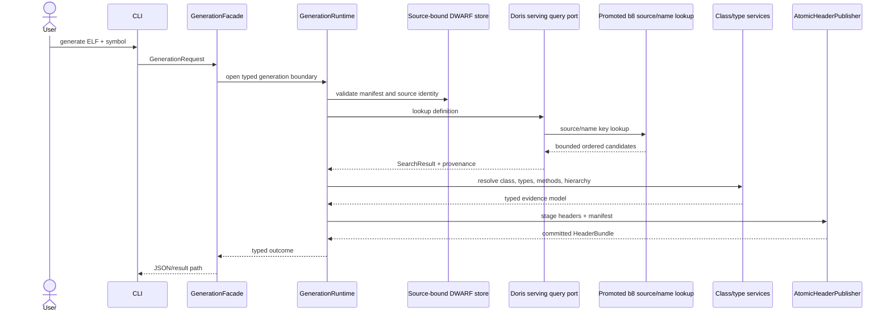
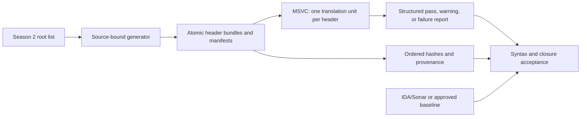

# Runtime flows

## Header generation

The compiler audit is a separate, change-triggered evidence path rather than a normal generation
dependency:

The historical 2026-08-10 Season 2 report passed all 2,760 headers. Warning-only compiler
diagnostics remain evidence; they do not become generated code or runtime dependencies. The
boundary-review baseline is separately normalized to 289 roots, 289 bundles, 289 manifests, 2,745
headers, 3,034 published files, and 2,745 MSVC units. The corrected post-refactor batch-001 run
matched all 598 compared header hashes, and its independent MSVC audit passed 598/598 units (the
focused 11/11 probe also passed). A fresh
full-corpus run is tracked separately and remains blocked by two host reboots; after the second
reboot Doris FE cannot bind its configured 9030 port because Windows excludes that port range.
That historical blocked state was closed by the completed post-refactor run on 2026-08-13; the
fresh run published all 289 roots and matched every baseline header and bundle manifest. The
independent MSVC closure passed 2,745/2,745 units with zero failures and zero timeouts. Incomplete
counts remain separate from this accepted full-corpus evidence.

## Knowledge export

The exporter shares the session, lookup, definition selection, type resolution, and evidence
authority with generation. It then serializes nodes, relationships, instructions, reconstructed
C++, and a manifest. The projection is deterministic and can be loaded by a future graph system.

## Durable reuse

Source identity is checked before a cache or dump index is reused. A warm key may avoid another
full hash when filesystem metadata proves the same object; explicit `verify` always rehashes the
complete source. The normal generation path consumes the source-bound analytical store and never
implicitly performs the expensive CU traversal. A failed atomic materialization leaves the previous
valid store available; the compressed-text SQLite index remains a validation-only cross-check.
Doris request hydration caches are reset at every Season 2 root, while the source/profile-bound
definition-selection cache is retained only after source fingerprint and schema validation. The
latter is a deterministic selection hint, not a compatibility fallback: disabling it changed
header bytes in the `rLayout`/`rTexture` dependency closure. Query sockets use bounded
connect/read/write timeouts, and any timeout or partial query remains non-complete evidence. The
completed benchmark observed warm exhaustive `rAIFSM` p95 of 15.796 seconds and peak RSS of 132.9
MiB; an empty transient Doris query cache is therefore not sufficient to explain the earlier
report of a materially slower `rAIFSM` run.
