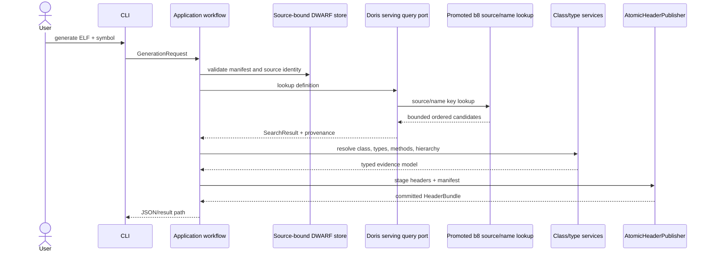
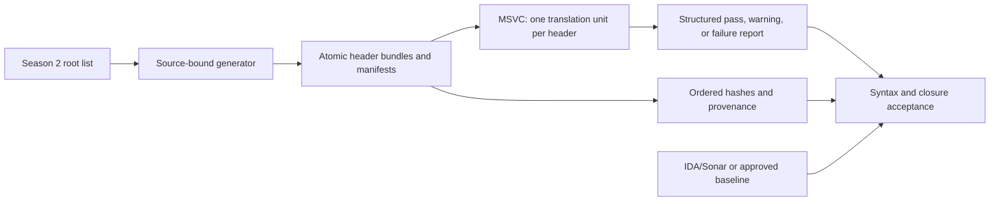

# Runtime flows

## Header generation

The compiler audit is a separate, change-triggered evidence path rather than a normal generation
dependency:

The final Season 2 report passed all 2,760 headers. Warning-only compiler diagnostics remain
evidence; they do not become generated code or runtime dependencies.

## Knowledge export

The exporter shares the session, lookup, definition selection, type resolution, and evidence
authority with generation. It then serializes nodes, relationships, instructions, reconstructed
C++, and a manifest. The projection is deterministic and can be loaded by a future graph system.

## Durable reuse

Source identity is checked before a cache or dump index is reused. A warm key may avoid another
full hash when filesystem metadata proves the same object; explicit `verify` always rehashes the
complete source. The normal generation path consumes the source-bound analytical store and never
implicitly performs the expensive CU traversal. A failed atomic materialization leaves the previous
valid store available; the compressed-text SQLite index remains a validation-only cross-check.
