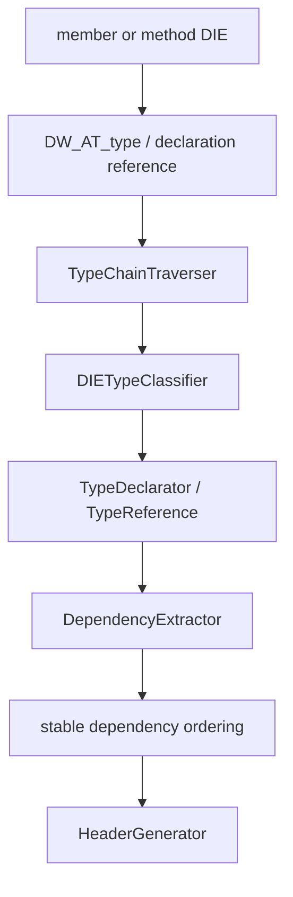

# DWARF type resolution

This page records the low-level path from a DIE reference to a generated C++ declaration. The
implementation is split so each policy has one owner.

## Resolution path

`LazyTypeResolver` follows references only when needed. The chain preserves typedefs, pointers,
references, arrays, qualifiers, function types, and terminal types. `TypeDeclarator` separates
the base type from declarator syntax so arrays and pointer/reference combinations render without
reimplementing parsing policy in the generator.

## Definition and hierarchy evidence

Definition selection prefers a complete, sized definition over a declaration-only DIE and retains
CU/DIE provenance. `HierarchyBuilder` walks bases with visited/cycle protection and asks the
class parser and index ports for each dependency. By-value dependencies are ordered before the
consumer; pointer/reference dependencies can be forward declared where valid.

## Layout and location evidence

Direct integer offsets and DWARF expressions such as `DW_OP_plus_uconst` and `DW_OP_constu` are
decoded by one location parser using ULEB128 operands. Offset `0` is evidence, not missing data.
PS3 DWARF2 expression samples and PS4 integer offsets share this parser; the focused tests cover
both formats and multi-byte operands.

## Failure states

Unknown tags, malformed references, unavailable search indexes, cycles, and conflicting candidates
produce bounded diagnostics or explicit evidence status. They do not silently become a guessed
type, offset, method body, or inheritance edge.
