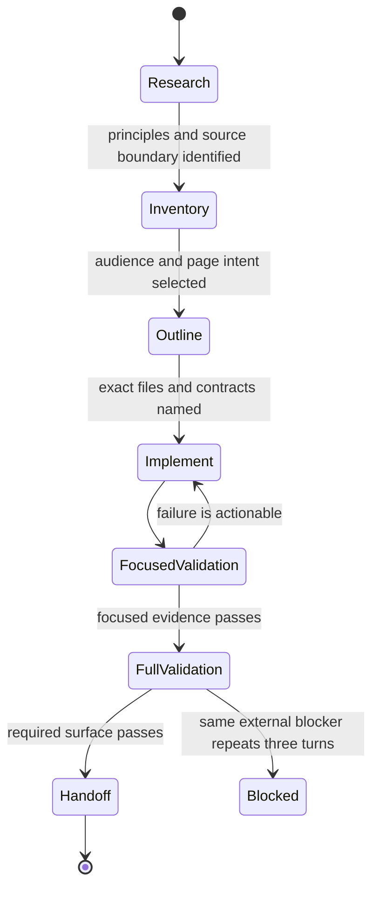

# Use a goal-oriented workflow

Use a thread-scoped goal when the work has a clear finish line but the path requires research,
multiple implementation slices, or evidence gathering. The goal is a workflow contract; it does
not replace `AGENTS.md`, the [documentation style](../reference/documentation-style.md), or the
active Spec Kit feature.

## Goal contract

Write these six fields before the first implementation slice:

1. **Outcome:** the observable result, not an activity such as “review docs.”
2. **Evidence:** files, source paths, tests, commands, manifests, or external results that prove it.
3. **Constraints:** behavior, byte-level artifacts, provenance, performance, and unrelated edits to
   preserve.
4. **Boundary:** explicitly excluded integrations, real assets, remote settings, or future work.
5. **Iteration:** the next evidence-sized action after each result.
6. **Blocker:** the concrete external prerequisite and the repeated check that would unblock it.

For documentation work, use this starting contract:

```text
Outcome: one source-backed page or documentation contract is complete.
Evidence: changed files, source/tests/spec links, docs-check, and applicable gates.
Constraints: preserve code behavior, generated evidence, stable commands, and unrelated edits.
Boundary: name excluded integrations, real assets, remote settings, or future work.
Iteration: research -> inventory -> outline -> write -> review -> validate -> retire.
Blocker: name the external prerequisite and the repeated check that would unblock it.
```

## Iterate in evidence-sized slices



Keep confirmed facts, approximations, blocked prerequisites, and remaining uncertainty separate.
Completion requires evidence; elapsed time, token budget, or confidence is not completion proof.

## Repository integration

- Record durable intent, exact paths, and validation tiers in `specs/<feature>/`.
- Keep source and tests authoritative for current behavior; keep specs authoritative for intended
  work; do not let a future task become a present capability through prose.
- For documentation, classify each page with Diátaxis and place architecture content in the
  applicable arc42 compartment before drafting.
- Update the site, README, instruction adapters, and testing/architecture references in the same
  slice when a public command or workflow changes.
- Track the next graph-loader step as `KG-001`; do not start live graph infrastructure as part of a
  writing-style change.
- Use `get_goal` for status and `update_goal` only when the named evidence surface is complete or
  the same blocking condition has repeated for three consecutive goal turns.

The OpenAI Cookbook's [goal workflow guidance](https://developers.openai.com/cookbook/examples/codex/using_goals_in_codex)
is the external rationale for this contract.
