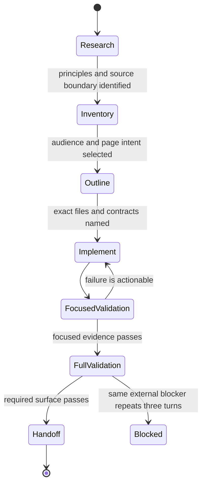

# Use a goal-oriented workflow

Use a thread-scoped goal when the work has a clear finish line but the path requires research,
multiple implementation slices, or evidence gathering. The goal is a workflow contract; it does
not replace `AGENTS.md`, the [documentation style](../reference/documentation-style.md), or the
active Spec Kit feature.

## Goal contract

Write these six fields before the first implementation slice:

1. **Outcome:** the observable result, not an activity such as “review docs.”
2. **Evidence:** files, source paths, tests, commands, manifests, or external results that prove it.
3. **Constraints:** behavior, byte-level artifacts, provenance, performance, and unrelated edits to
   preserve.
4. **Boundary:** explicitly excluded integrations, real assets, remote settings, or future work.
5. **Iteration:** the next evidence-sized action after each result.
6. **Blocker:** the concrete external prerequisite and the repeated check that would unblock it.

For documentation work, use this starting contract:

```text
Outcome: one source-backed page or documentation contract is complete.
Evidence: changed files, source/tests/spec links, docs-check, and applicable gates.
Constraints: preserve code behavior, generated evidence, stable commands, and unrelated edits.
Boundary: name excluded integrations, real assets, remote settings, or future work.
Iteration: research -> inventory -> outline -> write -> review -> validate -> retire.
Blocker: name the external prerequisite and the repeated check that would unblock it.
```

## Iterate in evidence-sized slices



Keep confirmed facts, approximations, blocked prerequisites, and remaining uncertainty separate.
Completion requires evidence; elapsed time, token budget, or confidence is not completion proof.

## Repository integration

- Record durable intent, exact paths, and validation tiers in `specs/<feature>/`.
- Keep source and tests authoritative for current behavior; keep specs authoritative for intended
  work; do not let a future task become a present capability through prose.
- For documentation, classify each page with Diátaxis and place architecture content in the
  applicable arc42 compartment before drafting.
- Update the site, README, instruction adapters, and testing/architecture references in the same
  slice when a public command or workflow changes.
- Track the next LadybugDB-first graph-loader step as `KG-001` in the dedicated feature record; do
  not start live graph infrastructure as part of a writing-style change.
- Use `get_goal` for status and `update_goal` only when the named evidence surface is complete or
  the same blocking condition has repeated for three consecutive goal turns.

The OpenAI Cookbook's [goal workflow guidance](https://developers.openai.com/cookbook/examples/codex/using_goals_in_codex)
is the external rationale for this contract.

## Analytical DWARF store example

The analytical store work uses two goals with the same six-field contract. Goal 1 is research and
design: its evidence includes the current parser, DWARF/LLVM/pyelftools behavior, and the primary
Parquet, Arrow, and Doris contracts. It may produce a claim ledger, compatibility matrix,
schema, and fixture round-trip, but it cannot approve a production dependency or runtime replacement
by itself. Goal 2 is materialization and migration: its evidence includes one-pass CU counters,
canonical row-store hashes, optional JSONL audit hashes, Parquet/Doris observations, query parity, generated-output hashes,
and cold/warm resource measurements.

The iteration is explicit:

```text
preflight -> deterministic fixture -> real-ELF subset -> full real ELF
  -> storage comparison -> query parity -> runtime migration -> repository gates
```

Each unavailable executable or service is recorded as `unavailable`, `blocked`, or
`not_observed`. In particular, a present LLVM source checkout is not LLVM verification evidence,
and a Compose file is not Doris load evidence without a healthy daemon and query/profile output.
Do not lower the correctness or 110%-of-baseline acceptance bar to make a goal complete; after the
same external blocker fails three consecutive goal turns, report it as blocked and preserve the
unfinished evidence boundary in the feature artifacts.

## Performance evidence goal

For profiling work, make the evidence surface concrete before running a large asset:

```text
Outcome: a typed performance run and historical summary exist for the named workload.
Evidence: run manifest, CPU/RSS/I/O metrics, method summaries, source identity, SQLite row,
          deterministic exports, and the exact validation command.
Constraints: preserve output bytes, cache identity, ordering, provenance, and normal-run overhead.
Boundary: raw profiles, proprietary inputs, cold-index cost, and unavailable external tools remain
          explicit environmental evidence.
Iteration: doctor -> fixture -> warm real asset -> profiler cross-check -> cold index -> function/
line traces -> candidate matrix -> one optimization slice -> regression -> benchmark -> export.
Blocker: record the prerequisite and status; after three repeated checks, stop and report it.
```

Use `performance doctor` before selecting profilers, `test-performance-fixtures` for a deterministic
gate. Use `performance profile-index` for a separately measured cold compressed-dump rebuild and
`performance-profile-index-traces` when function/line attribution is missing. Use
`performance history compare/export` only after checking that source, state, interpreter, machine, and
configuration are compatible. Treat profiler runs as attribution evidence, not as timing baselines,
and keep neutral or inconclusive optimization candidates recorded rather than promoted.

For runtime/compiler questions, add the runtime identity and build boundary to the goal. Use
`performance compare-runtimes` with the same source-bound workload for CPython, a validated
Nuitka launcher, and an explicitly installed free-threaded CPython venv. Record build time,
onefile extraction I/O, output-manifest equality, dependency failures, and upstream compiler
blockers separately; a skipped or blocked free-threaded tool is not a replacement baseline.
