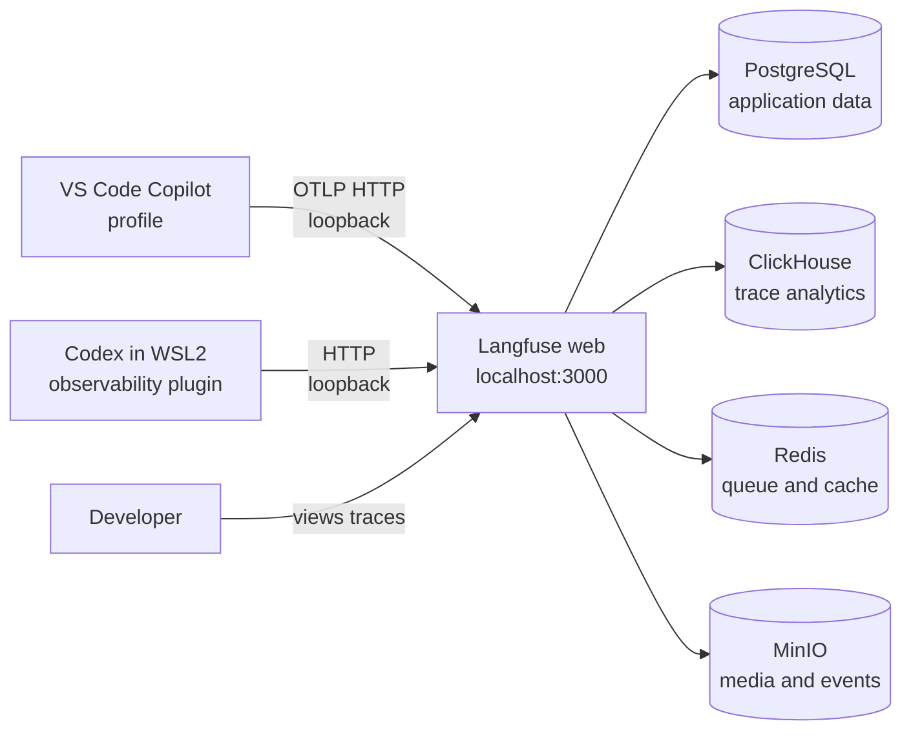

# Configure local Langfuse developer tracing

Use this how-to when you want local traces from GitHub Copilot in VS Code or OpenAI Codex in
WSL2. It provisions a loopback-only Langfuse stack and configures the developer tools to send
telemetry to it. The Python reconstructor is not instrumented by this setup; its runtime logging
contract is documented in [application logging](../observability.md), and the architecture policy
is in [crosscutting concepts](../../explanation/architecture/crosscutting-concepts.md).

<!-- markdownlint-disable MD046 -->

!!! warning "Local and potentially sensitive"

    Content capture can retain prompts, responses, reasoning summaries, tool arguments, tool
    output, and source text that appears in those values. Use a non-sensitive test prompt first.
    Keep `ops/langfuse/.env`, Codex key files, and VS Code settings containing Basic Auth values
    out of version control. The compose file binds its host ports to loopback, but the data is
    still durable on the local Docker volumes.

<!-- markdownlint-enable MD046 -->

## What this setup covers

| Surface | Included behavior | Not included |
| --- | --- | --- |
| Langfuse | Local UI and OTLP HTTP ingestion at `http://localhost:3000` | Cloud tenancy, HA, remote backup, or production deployment |
| VS Code Copilot | Opt-in OpenTelemetry export from a dedicated VS Code profile | Repository-local `.vscode` override of application-scoped settings |
| OpenAI Codex | Opt-in WSL2 plugin that uploads turn traces | A change to the Python application's telemetry or logging code |
| Persistence | Named PostgreSQL, ClickHouse, MinIO, and Redis volumes | Automatic backup or cross-machine replication |



The compose source is the authority for images, ports, health-gated dependencies, credentials,
and volume names: [`ops/langfuse/compose.yaml`](../../../ops/langfuse/compose.yaml) and
[`ops/langfuse/.env.example`](../../../ops/langfuse/.env.example). The repository notes prior
validation with Docker Compose `v5.3.1`; check `docker compose version` before diagnosing a
version-specific problem.

## Prerequisites

- Windows 11 with Docker Desktop using the WSL2 engine.
- WSL integration enabled for the Linux distribution where Codex runs.
- Docker Desktop configured to start when you sign in if you want automatic container restart.
- PowerShell 5.1 or newer for the repository recipes.
- Node.js 22 or newer and Codex 0.128 or newer for the Codex plugin path.
- A local checkout with the root uv environment installed.

Confirm the external tools before changing project configuration:

```powershell
docker version
docker compose version
node --version
codex --version
```

Docker Desktop must be running before the configuration check or startup command. WSL2 commands
must be run in the distribution that owns the Codex installation, not in an unrelated shell.

## Start the local stack

1. Create the ignored environment file and replace every `REPLACE_WITH` value with a long random
   value. `ENCRYPTION_KEY` must be a 64-character hexadecimal value.

   ```powershell
   Copy-Item ops/langfuse/.env.example ops/langfuse/.env
   code ops/langfuse/.env
   ```

2. Validate interpolation without starting containers:

   ```powershell
   uv run just langfuse-config
   ```

   The recipe is equivalent to `docker compose ... config` with project name `ddon-langfuse`.
   It should fail if a required secret is still unset.

3. Start the health-gated stack and inspect its status:

   ```powershell
   uv run just langfuse-up
   uv run just langfuse-status
   uv run just langfuse-logs
   ```

   `langfuse-up` starts the containers in detached mode; it does not wait for the web service to
   become ready. Open [http://localhost:3000](http://localhost:3000) after the web logs settle.

4. Create the first local account and project in the UI. Copy that project's public and secret
   keys from its project settings before configuring either client. The compose file does not
   perform headless user or project initialization.

The host-visible endpoints are intentionally limited to the local machine:

| Service | Address | Purpose |
| --- | --- | --- |
| Langfuse web | `http://localhost:3000` | UI and OTLP ingestion |
| MinIO API | `http://localhost:9090` | External media upload endpoint used by the web container |
| PostgreSQL, ClickHouse, Redis, MinIO console | Compose network only | Internal persistence and administration |

## Configure VS Code Copilot

Copilot's OTEL settings are application-scoped. Use a separate VS Code profile so this project's
keys and endpoint do not become a machine-wide default for unrelated repositories.

Create or open the checkout with a dedicated profile:

```powershell
code --profile "ddon-dwarf-reconstructor-langfuse" --new-window .
```

In that profile's **User** `settings.json`, add the following and substitute the project's keys:

```jsonc
{
  "github.copilot.chat.otel.enabled": true,
  "github.copilot.chat.otel.exporterType": "otlp-http",
  "github.copilot.chat.otel.protocol": "http/json",
  "github.copilot.chat.otel.otlpEndpoint": "http://localhost:3000/api/public/otel",
  "github.copilot.chat.otel.captureContent": true,
  "github.copilot.chat.otel.maxAttributeSizeChars": 0,
  "github.copilot.chat.otel.serviceName": "vscode-copilot-chat-ddon-dwarf-reconstructor",
  "github.copilot.chat.otel.headers": {
    "Authorization": "Basic <base64(public-key:secret-key)>",
    "x-langfuse-ingestion-version": "4"
  }
}
```

Generate the Basic Auth value locally; do not paste the raw secret into a repository file:

```powershell
$langfusePair = "$PublicKey`:$SecretKey"
$langfuseAuth = [Convert]::ToBase64String(
    [Text.Encoding]::ASCII.GetBytes($langfusePair)
)
$langfuseAuth
```

Do not set `OTEL_EXPORTER_OTLP_HEADERS` globally. A global value can route every repository to
this project's Langfuse project. Reload or restart the profile after changing the OTEL settings.
With content capture enabled, Copilot can emit agent spans, model generations, tool calls, token
usage, session identifiers, Git context, prompts, responses, and tool arguments.

## Configure Codex in WSL2

Run these commands in the WSL2 distribution where Codex is installed:

```bash
codex plugin marketplace add langfuse/codex-observability-plugin
```

Enable plugin hooks in `~/.codex/config.toml`:

```toml
[features]
plugin_hooks = true

[plugins."tracing@codex-observability-plugin"]
enabled = true
```

Create `~/.codex/langfuse.json` with the keys from the local project:

```json
{
  "enabled": true,
  "public_key": "pk-lf-replace-me",
  "secret_key": "sk-lf-replace-me",
  "base_url": "http://localhost:3000"
}
```

Protect the file and opt in only in the shell that launches Codex:

```bash
chmod 600 ~/.codex/langfuse.json
export TRACE_TO_LANGFUSE=true
export LANGFUSE_CODEX_MAX_CHARS=20000
codex
```

The plugin reads the Codex transcript after each turn and fails open when upload fails, so a
Langfuse outage should not block a Codex session. The trace can include prompts, assistant
messages, reasoning summaries, tool inputs and outputs, model metadata, token usage, and nested
subagent sessions.

Check loopback connectivity before debugging the plugin:

```bash
curl -fsS http://localhost:3000 >/dev/null && echo 'Langfuse is reachable'
```

## Verify a trace end to end

1. Run `uv run just langfuse-status` and confirm the containers are healthy.
2. Start a new VS Code Copilot conversation with a non-sensitive prompt that causes one simple
   tool call.
3. Start one Codex turn with a non-sensitive prompt if the WSL2 path is enabled.
4. Open `http://localhost:3000`, select the configured project, and inspect its traces.
5. Confirm that the trace fields match the selected integration and content-capture setting.

If no trace appears, check in this order:

- `uv run just langfuse-status` and `uv run just langfuse-logs`.
- The VS Code process was fully restarted after the profile settings changed.
- The Basic Auth value is one line with no trailing newline.
- Codex has `plugin_hooks = true`, the tracing plugin is enabled, and
  `TRACE_TO_LANGFUSE=true` is present in its launch shell.
- Every client uses `http://localhost:3000`, not a Langfuse Cloud region URL.
- The Langfuse web container can reach its health-gated dependencies.

## Reduce or disable capture

For metadata-only Copilot tracing:

```jsonc
{
  "github.copilot.chat.otel.captureContent": false
}
```

Disable Copilot export entirely with `github.copilot.chat.otel.enabled = false`. Disable Codex
tracing for a shell session with:

```bash
export TRACE_TO_LANGFUSE=false
```

Do not treat redaction as a substitute for a non-sensitive test prompt. Content can enter traces
through tool arguments or output even when the prompt itself looks harmless.

## Stop, update, and remove the stack

These commands preserve the named volumes unless explicitly told otherwise:

```powershell
uv run just langfuse-stop  # temporarily stop containers
uv run just langfuse-up    # start existing containers again
uv run just langfuse-down  # remove containers and network, preserve volumes
```

Pull coordinated image versions from the repository's `.env.example` and recreate without volume
deletion:

```powershell
docker compose --project-name ddon-langfuse --file ops/langfuse/compose.yaml --env-file ops/langfuse/.env pull
docker compose --project-name ddon-langfuse --file ops/langfuse/compose.yaml --env-file ops/langfuse/.env up -d
```

`down --volumes` is destructive: it removes the local trace data in the five named volumes. Back
up the volumes before Docker Desktop reinstallation or any destructive maintenance. This setup is
for local development observability; it has no high-availability, remote-backup, or multi-host
scaling contract.
