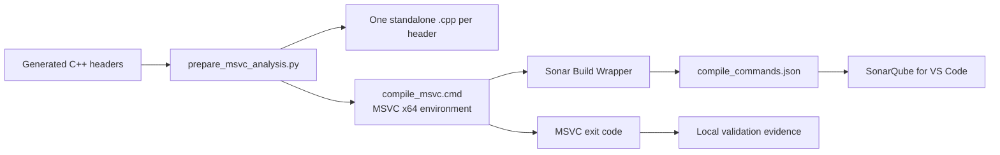

# Prepare local SonarQube C/C++ analysis

Use this how-to when you need SonarQube for VS Code to inspect the generated C++ headers with the
same MSVC x64 validation command used by the repository. The workflow creates a compilation
database through Sonar's Windows Build Wrapper. It is an opt-in local diagnostic workflow, not a
runtime dependency and not a replacement for deterministic producer evidence.

The architecture policy and evidence boundary are described in
[crosscutting concepts](../../explanation/architecture/crosscutting-concepts.md). The executable
adapter is [`tools/sonar/prepare_msvc_analysis.py`](../../../tools/sonar/prepare_msvc_analysis.py),
and its focused tests are in
[`tests/tools/sonar/test_prepare_msvc_analysis.py`](../../../tests/tools/sonar/test_prepare_msvc_analysis.py).



The default path deliberately excludes the optional aggregate translation unit. Representative
headers can repeat declarations, so aggregate compilation is diagnostic-only and must not be
confused with the per-header database used by Sonar.

## Prerequisites

- SonarQube for VS Code installed and enabled.
- Visual Studio with the MSVC x64 build tools and `VsDevCmd.bat`.
- `vswhere.exe` at the standard Visual Studio Installer location.
- The root uv environment installed with `uv sync --python 3.14.7 --locked`.
- SonarSource's Windows Build Wrapper downloaded outside the repository.

Sonar's supported C/C++ setup is described in [Analyze C and C++ code](https://docs.sonarsource.com/sonarqube-for-vs-code/getting-started/running-an-analysis#analyze-c-and-cpp-code).
The adapter also records the exact MSVC flags that it expects:

```text
/std:c++latest /EHsc /W4 /Zc:__cplusplus
```

Check the local prerequisites before troubleshooting generated output:

```powershell
where.exe vswhere
where.exe cl
uv run python -m tools.sonar.prepare_msvc_analysis --help
```

`where.exe cl` can fail outside a Visual Studio developer shell; the adapter itself resolves and
loads the x64 developer environment through `vswhere.exe`.

## Install the Windows Build Wrapper

Keep the wrapper and its output outside source control. The adapter searches this default path:

```text
%LOCALAPPDATA%\SonarSource\build-wrapper-win-x86\build-wrapper-win-x86\build-wrapper-win-x86-64.exe
```

Install it for the current user if the default path is absent:

```powershell
$sonarInstallRoot = Join-Path $env:LOCALAPPDATA 'SonarSource\build-wrapper-win-x86'
$sonarArchivePath = Join-Path $env:TEMP 'build-wrapper-win-x86.zip'
New-Item -ItemType Directory -Path $sonarInstallRoot -Force | Out-Null
Invoke-WebRequest `
    -Uri 'https://sonarcloud.io/static/cpp/build-wrapper-win-x86.zip' `
    -OutFile $sonarArchivePath
Expand-Archive -LiteralPath $sonarArchivePath -DestinationPath $sonarInstallRoot -Force
```

If you use another location, pass it explicitly with `--build-wrapper-path`.

## Validate and capture

Run the configuration check first. It resolves the Visual Studio developer command file and probes
the compiler without creating a wrapper output directory:

```powershell
uv run just sonar-validate
```

After generated headers exist in the configured validation bundle, capture the compilation
database. For season two, point the adapter at one generated root bundle under
`output/season2/<platform>/symbols/<index>-<safe-root>/` or copy one selected bundle into the
configured validation directory; do not merge all roots before standalone validation.

```powershell
uv run just sonar-capture
```

The adapter performs these steps:

1. Finds generated headers in the validation directory and sorts them deterministically.
2. Writes one standalone translation unit per header plus the optional `compile_all.cpp` aggregate.
3. Writes `compile_msvc.cmd` with the required MSVC flags.
4. Runs that script through the Windows Build Wrapper in the Visual Studio x64 environment.
5. Validates that the resulting JSON compilation database contains C/C++ entries and the required
   MSVC flags.
6. Prints a bounded JSON result to stdout; diagnostics and failures go to stderr.

The default output is:

```text
output/msvc-header-validation-20260801/sonar-build-wrapper/compile_commands.json
```

The output bundle also contains `sonar-inputs.json`, the generated translation units, the command
file, and the wrapper's environment data. These are machine-specific and ignored by the existing
`output/` rule.

The default mode is strict: the command returns the MSVC validation exit code. If a known header
closure failure still leaves a valid compilation database that you need to inspect, use the
explicit analysis-only mode:

```powershell
uv run python -m tools.sonar.prepare_msvc_analysis --allow-validation-failure
```

This mode still requires a valid database and reports the original compiler exit code. It does
not make a header compile, suppress diagnostics, or promote incomplete analysis to acceptance
evidence. Keep the generated-header failure and Sonar observations separate.

To inspect the optional aggregate independently, compile
`output/msvc-header-validation-20260801/translation-units/compile_all.cpp` in the same MSVC
environment and record its diagnostics separately from the Sonar database.

Standalone MSVC success is the header-closure evidence. Sonar findings are additive diagnostics,
and IDA comparisons are a separate authority/gap-catalog surface; neither may be reported as a
successful full-corpus validation without its own retained result.

## Point SonarQube for VS Code at the database

Open this repository in VS Code after capture. Set the full local path in user or workspace
settings, depending on how machine-specific you want the selection to be:

```json
{
  "sonarlint.pathToCompileCommands": "D:/ddon-dwarf-reconstructor/output/msvc-header-validation-20260801/sonar-build-wrapper/compile_commands.json"
}
```

The repository's `.vscode/settings.json` uses a workspace-relative environment placeholder; do
not commit a machine-specific absolute path. You can also use the SonarQube panel action to select
the database. Open a generated C++ translation unit or header and save it to trigger analysis.

## Verify the result

Treat three signals separately:

| Signal | Meaning | Evidence tier |
| --- | --- | --- |
| `sonar-validate` succeeds | Wrapper, Visual Studio discovery, and compiler probe are configured | Local toolchain configuration |
| `sonar-capture` succeeds in strict mode | The generated translation units compiled and the database is structurally valid | Local MSVC acceptance evidence |
| SonarQube issues appear | The editor analyzed the captured commands | Additive diagnostic evidence |

The deterministic producer facts remain authoritative even when Sonar reports a warning. Record
the output directory, header manifest, compiler exit code, database path, and tool version when
using Sonar output in a review or feature artifact.

## Troubleshoot in evidence order

- **Build Wrapper not found:** pass `--build-wrapper-path` with the full path to
  `build-wrapper-win-x86-64.exe` and rerun `sonar-validate`.
- **MSVC not found:** install the Visual Studio C++ x64 workload and rerun the validation command.
- **No C/C++ entries:** confirm that `compile_msvc.cmd` compiled at least one `.cpp` file and
  inspect the wrapper output for the matching `compile_commands.json`.
- **Generated-header errors:** use strict mode to preserve the failure. Use
  `--allow-validation-failure` only to inspect a valid captured database while fixing the header
  closure separately.
- **Stale analysis:** regenerate after changing generated headers, compiler flags, or include
  paths; then refresh the database in the SonarQube panel.
- **Aggregate failures:** treat `compile_all.cpp` as optional diagnostic evidence. The default
  per-header closure database is the intended Sonar input.
