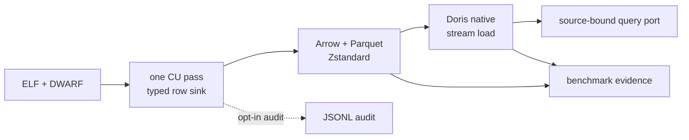

# Analytical DWARF store reference

This page describes the supported store boundary for generation and knowledge export. The
research record, compatibility gates, and measured-evidence ledger live in
 [`Feature 019 specification`](https://github.com/ddon-research/ddon-dwarf-reconstructor/blob/main/specs/019-analytical-dwarf-store/spec.md).

## Contract

`artifacts materialize-dwarf` opens the named ELF, traverses every compilation unit once, and
publishes an atomic, source-bound directory. The canonical logical contract is a typed row stream
written directly to Parquet. `records.jsonl` is an opt-in audit/interchange
projection for fixtures and targeted debugging. Both contain source identity and section inventory
records, CU headers, every DIE including null terminators, stable traversal ordinals,
parent/reference edges, and attributes with both raw and decoded tagged values. Unsupported forms,
duplicate offsets, offset zero, supplementary references, and unresolved targets remain records
rather than being discarded.

The derived families are also typed and source-bound: `range`, `location`, `line`, `macro`, `frame`,
`abbreviation`, and `name`. They retain the original record offsets and parser status. Macro sections
are published as `raw_only` rows with a checksum when the installed pyelftools API does not expose
a decoder; the raw section remains available for a later decoder or external LLVM cross-check.

The Doris runtime facade consumes the typed `line` family through the serving projection. It
reconstructs the CU file list and line-state entries needed by declaration-file resolution, so
generation does not reopen the ELF or read Parquet merely to recover line-program metadata.

Raw sections are copied with bounded I/O into checksummed files. Large byte attributes are external
checksummed chunks referenced by typed value columns (and, when enabled, by the JSONL audit row).
The manifest validates all relative paths and the current source hash before a runtime can open the
store. A complete manifest also records the producer/schema/configuration identity, CU and family
counts, and one immutable descriptor for every closed Parquet file: relative path, family, byte
size, modification timestamp, SHA-256, compression, footer status, and row-group row counts. The
publisher validates the hashes and reads every closed row group before complete publication. Normal
store loading validates the closed footer plus recorded size and modification metadata;
`inspect-dwarf-store` also verifies the full file hashes and compressed payload readability.

Publication completeness and DWARF semantic completeness are separate evidence fields. A source may
use an explicit, source-identity-bound recovery profile only when an independent LLVM dump records
the affected DIEs and guarded context bytes. When the original contexts are present, the profile is
an in-memory overlay and raw sections retain the original bytes. When all repaired contexts are
already present in the source, no overlay is installed and the manifest records
`status=already_applied`; this preserves the source bytes while retaining the same semantic
evidence. In both cases `configuration.dwarf_recovery` records the profile, evidence artifact, and
every replacement. The recovered DDOORBIS profile restores three `DW_TAG_formal_parameter [15]`
records and their six verified bytes before pyelftools traversal.

Without an approved recovery profile, malformed DWARF may still produce closed Parquet files and raw
sections, but the outer manifest is `partial` and records `configuration.parse_error_count > 0`.
The affected unit is marked `parser_status=partial`, its diagnostic includes the invalid form/code
and source offset, and the raw section/chunk rows remain authoritative. Such a publication is
storage-complete for diagnostics but is not runtime or header-acceptance evidence: generation,
knowledge export, Doris loading, and parity remain fail-closed until the
affected query surface is recovered or explicitly accepted by the evidence gate. A known source
without its required recovery profile is also rejected as stale.



The production path deliberately does not serialize JSON and then reload it into Doris. Arrow
rows are normalized once during the CU pass, Parquet is the replayable physical input format, and
Doris is loaded through the native-table path and is the sole normal serving backend. JSONL remains useful
when a person needs a line-oriented audit artifact or a small fixture, but it is not a required
intermediary or a runtime dependency.

## Commands

```powershell
uv sync --locked
uv run ddon-dwarf-reconstructor artifacts materialize-dwarf <ELF> `
  --output-dir <external-store-root> --write-parquet
uv run ddon-dwarf-reconstructor artifacts materialize-dwarf <ELF> `
  --output-dir <external-store-root> --write-jsonl --write-parquet
uv run ddon-dwarf-reconstructor artifacts materialize-dwarf <ELF> `
  --output-dir <external-store-root> --checkpoint-every-cus 64
uv run ddon-dwarf-reconstructor artifacts materialize-dwarf <ELF> `
  --output-dir <external-diagnostic-root> --max-cus 1
uv run ddon-dwarf-reconstructor artifacts inspect-dwarf-store <manifest.json>
uv run ddon-dwarf-reconstructor artifacts inspect-dwarf-store <checkpoint.json> `
  --allow-incomplete
uv run ddon-dwarf-reconstructor performance benchmark-dwarf-store <ELF> `
  --store-manifest <checkpoint.json> --allow-incomplete --output-dir <external-diagnostic-root>
uv run ddon-dwarf-reconstructor performance benchmark-dwarf-store <ELF> `
  --output-dir <external-benchmark-root>
uv run ddon-dwarf-reconstructor performance benchmark-dwarf-store <ELF> `
  --output-dir <external-benchmark-root> --run-current-baseline `
  --baseline-dwarf-dump <external-dump.zst> --baseline-dwarf-index <external-index.sqlite3>
uv run ddon-dwarf-reconstructor artifacts load-doris <manifest.json> `
  --dry-run
uv run ddon-dwarf-reconstructor artifacts load-doris <manifest.json>
```

`generate` and `export-knowledge` require the same source-bound manifest through `--dwarf-store`.
Before either command, the complete manifest must be loaded successfully into Doris; the loader
publishes a source registry only after the observed family counts reconcile with the manifest.
They do not implicitly materialize, open the ELF for a fallback traversal, read Parquet/JSONL, or
consult the old compressed-text SQLite index. Store-backed session setup also disables automatic
sibling and environment dump discovery. The old index remains available only for explicitly
labeled parity and cross-check evidence.

For durable local reuse, place the complete store under
`output/analytical-dwarf/main/store-<source-sha16>/`. Use `%TEMP%\ddon-analytical-dwarf` for
checkpoints, bounded probes, profiler output, and crash evidence only. A checkpoint or `--max-cus`
publication is diagnostic and requires `--allow-incomplete`; it is not a generation or Doris
input.

## Projection and query policy

Parquet uses one nullable typed schema per record family. Offsets, names, forms, relations, and
common scalar DWARF values are physical columns; only genuinely heterogeneous tagged values use a
per-value JSON escape column. Unsigned DWARF integers use exact `DECIMAL(20,0)` Parquet columns
instead of Arrow `UINT64`: Arrow restores them to Python integers, while Doris maps the
corresponding native columns to `LARGEINT` without signed-`BIGINT` overflow. This is a physical
compatibility rule, not JSON
stringification. Rows are written during CU traversal, not by re-reading JSONL. The canonical
projection is partitioned by family and source identity, with
Zstandard compression, 512 MiB fact-table and 128 MiB derived-index row-group targets, 4,096-row
Arrow flush thresholds, and hard native-conversion caps of 65,536 fact rows and 32,768 derived
rows. The caps protect the Windows pyarrow conversion boundary when constant-time row-size
estimates understate nested DWARF values. The opt-in `bucketed` layout adds `unit_bucket` to
directory partitioning for historical or measured pruning experiments; it is not the canonical
producer layout. Both layouts retain the physical
`unit_bucket` `int64` column so row-group statistics and explicit filters remain available. Doris
native
tables mirror those families with `DUPLICATE KEY` semantics, source-first/offset sort keys,
`HASH(source_id, unit_offset)` distribution for unit-scoped families, Bloom filters for equality
lookups, and inverted indexes on names and attribute names. JSON escape columns are never primary
indexes. Arrow dataset consumers must use the repository's layout-specific typed Hive partition
schema: family stores declare `source_id: string`, while historical bucketed stores additionally
declare `unit_bucket: int64`; automatic directory inference is not authoritative. The analytical
default runtime analytical baseline is `pyarrow==25.0.0`, `PyMySQL==1.2.0`, and `SQLAlchemy==2.0.51`. The local Doris benchmark uses
pinned 4.1.3 FE/BE images. MySQL/PyMySQL remains the default connection and load path; Doris
documents Arrow Flight SQL as experimental, so it is an opt-in benchmark profile with separate
FE/BE ports rather than the default runtime.

### PyArrow 25 design boundary

The default project runtime pins `pyarrow==25.0.0`. The local PyArrow reference checkout at
`D:\PyArrow-25.0-python-docs` is the first source for Arrow concept and API questions. Its schema,
Parquet, Dataset, and memory/IO sections support the implementation choices here:

- `schema_for()` supplies an explicit immutable Arrow schema for every record family. The producer
  does not infer a family schema from the first batch.
- `ParquetWriter` appends controlled row groups. The producer retains the 512 MiB/128 MiB progress
  targets but also caps the rows passed to `Table.from_pylist()` because nested DWARF values can
  make a constant-time byte estimate optimistic on the Windows native extension boundary.
- `pyarrow.dataset` readers use the layout-specific typed Hive partition schema, project only the
  needed columns, and apply source/CU filters. Large scans should use `to_batches()` rather than
  materializing a whole dataset with `to_table()`.
- `pa.total_allocated_bytes()` and `pa.default_memory_pool().backend_name` are useful bounded
  telemetry. They do not represent all Python/native RSS, and Arrow's `memory_map` option does not
  make compressed Parquet resident memory-free.

When a complete JSONL audit store later requests a Parquet projection, the backfill reuses the same
bounded `ParquetRecordSink` as direct materialization. It honors the existing manifest's
`parquet_layout` and `max_open_writers`, records writer metrics, validates closed footers and
payloads, and replaces the temporary projection atomically. This keeps the audit format an
interchange boundary rather than introducing a second unbounded writer implementation.

## Doris optimization boundary

The current schema uses append-only `DUPLICATE KEY` tables, source-first/offset sort keys, the
physical `unit_bucket` column, Bloom filters for source/offset/target equality, and inverted indexes for
names. Doris's [schema and index guidance](https://doris.apache.org/docs/4.x/query-acceleration/tuning/tuning-plan/schema-and-index-optimization/)
also requires checking key order, skew, prefix pruning, and scan behavior. A `SHOW INDEX` result or
an `EXPLAIN` plan alone is not a performance claim: the benchmark retains no-cache and warm
profiles with scan rows/bytes, operator time, peak memory, and spills using
[`doris-cli`](https://github.com/apache/doris-cli).

The default producer bounds native Parquet writers at 16 open family/source writers. The canonical
family layout avoids one writer per CU bucket and closes all family writers every 64 CUs by default;
`--rotate-writers-every-cus N` changes that interval and `0` disables boundary rotation. This is
not a checkpoint publication: the manifest records `cu_boundary_rotations` separately from
capacity and checkpoint rotations. The historical `bucketed` layout remains available for explicit
comparison. Override the open-writer bound with `--max-open-writers N` when measuring another
lifecycle. In-flight files still have no readable footer and are not a query surface; the manifest
records the configured layout, limit, peak open-writer count, and every rotation class. Row-group progress uses a
constant-time per-column estimate; it is only a flush trigger and never a storage-size or
correctness measurement, so the producer does not walk and UTF-8-encode every scalar on the hot
path. An explicit
`--checkpoint-every-cus N` mode additionally publishes an in-progress manifest after closing and
rotating writers at CU boundaries, records the immutable
file list in `checkpoint.json`, and preserves the latest checkpoint after an interruption. The
checkpoint manifest has status `in_progress`; loading it requires the explicit
`--allow-incomplete` inspection flag and query results are `partial`. Normal generation, Doris
loading, and complete-store lookup continue to reject it. Checkpoints are a diagnostic/query
surface, not complete-ELF coverage evidence, and their writer-rotation overhead must be measured
before using them for a production benchmark. The matching diagnostic benchmark command accepts
the checkpoint manifest with `--store-manifest --allow-incomplete`; it queries only the immutable
Parquet file list recorded by that checkpoint, reports a `partial` report, and marks Doris
`not_observed`. It never treats open parts or a partial query as production evidence.

`--max-cus N` is a separate bounded parser/schema probe. It publishes a `partial` manifest after
the requested CU prefix and is useful for real-ELF compatibility checks without waiting for the
full corpus. It cannot load into Doris, satisfy generation or knowledge-export
requirements, or count as complete-CU evidence. A bounded probe is inspected only with
`--allow-incomplete` and must remain under an external diagnostic directory.

The first service review also found that the already-loaded v9 fixture predates the source-first
DDL: its `SHOW CREATE TABLE` still uses offset-first keys and `HASH(unit_offset)`, and its tiny
`EXPLAIN` touches all 16 tablets. The revised generator now places every `DUPLICATE KEY` column
at the physical schema prefix, as required by Doris, and a fresh high-value database accepted the
fourteen-table DDL, loaded eight files, and completed statistics. The old service tables are not
retroactively treated as evidence for the revised layout; the fresh tiny-fixture profile still
touches every tablet, so full-corpus pruning and latency remain open benchmark questions.
Global DIE-offset lookup without a CU offset is a separate candidate: if the full query suite shows
it dominates, add a narrow source/DIE locator projection rather than widening the hot fact query.
That duplication is deliberately not enabled from the tiny-fixture evidence alone.

Native loading uses HTTP Stream Load for local Parquet. Doris's [POC checklist](https://doris.apache.org/docs/4.x/getting-started/before-you-start-the-poc/)
and [load guidance](https://doris.apache.org/docs/4.x/data-operate/import/load-manual/) support
that choice for local files, while the checked-out source is
`D:\Apache-Doris-version-4.x-docs`. Statistics are an explicit evidence step: Doris's [statistics
guide](https://doris.apache.org/docs/4.x/query-acceleration/optimization-technology-principle/statistics/)
supports manual `ANALYZE` for native tables; `artifacts load-doris` submits it by default and
`DDON_DORIS_ANALYZE_WAIT_SECONDS` optionally waits for `SHOW ANALYZE` terminal states. The
`information_schema.statistics` and `information_schema.column_statistics` compatibility views
remain empty; use `SHOW TABLE STATS`, `SHOW COLUMN STATS`, `SHOW ANALYZE`, `SHOW AUTO ANALYZE`, and
`__internal_schema.column_statistics` for Doris statistics evidence.
Materialized
views are deferred because the one-pass producer already
materializes definition and method indexes; they are added only if full-export profiles expose a
repeated join or aggregation hotspot.

The query port returns structured completeness and provenance. `partial`, `unavailable`, and
`not_found` are distinct states; a partial analytical result cannot be consumed as complete
generation evidence. Doris plans are emitted without contacting the service; execution and
`EXPLAIN`/profile output are separate acceptance evidence. The two legacy baseline workloads are
opt-in because the live pyelftools path and a missing compressed-dump sidecar can each require a
large full scan. The report keeps each baseline `not_observed` or `blocked` until explicitly run;
neither state can satisfy the 110%-of-baseline gate.

The same fail-closed rule applies to a non-zero `parse_error_count`: the closed files and raw
evidence may be inspected diagnostically with `--allow-incomplete`, but a runtime consumer must
not silently treat missing structured rows from a partial CU as complete. Applying a recovery
profile is not a waiver: the full traversal must still finish with zero parse errors, complete-CU
counts, payload validation, and header/query parity.

### Promoted main store and current serving boundary

The promoted v1.1 source-bound store is
`output/analytical-dwarf/main/store-4236f598acc8f158/manifest.json`. Its manifest records 2,305
compilation units, 597,338,011 typed rows, 1,452 closed Zstandard Parquet artifacts, and zero
parser diagnostics. This durable path is the canonical input for current generation, knowledge
export, and native-Doris loading. `%TEMP%\ddon-analytical-dwarf` remains a disposable location
for checkpoints, bounded probes, profiles, and crash diagnostics; a Temp path or versioned run
label is not a durable store identity.

The loader's supported Doris database default is `dwarf`. Versioned databases and external Temp
stores in the sections below are historical serving measurements. Current acceptance still needs
native row-count parity, authoritative `SHOW TABLE STATS`/`SHOW COLUMN STATS`/`SHOW ANALYZE`
evidence, tablet health, cold/warm profiles, full season-two generation, and the approved MSVC
header comparison. The removed Iceberg runtime is not part of the current loading or acceptance
path.

### Historical full-corpus Doris serving result (v9)

The complete v9 store was loaded into native Doris database `dwarf_full_v9_20260806` using 413
concurrent-capable, individually labeled Parquet Stream Loads. The 14 family counts equal the
source-bound manifest: 596,944,504 rows, including 95,540,741 DIEs and 35,682,130 derived index
rows. All native tables are `NORMAL`, all 14 statistics jobs finished without failure, and the
source/CU/DIE plan prunes `full_die` to one of 16 tablets.

The full name lookup has a different access shape. The canonical `full_index` table touches all
eight index tablets when only `source_id`, `index_type`, and `name` are known. A separately
provisioned `full_index_name_candidate` serving projection was measured with the compiled Doris
CLI: ordered `rLayout`/`MtObject` results match the canonical index, scan bytes fall from about
155 MB to 34 MB, and the paired no-cache profile falls from 13 ms to 6 ms. The full 36-query
suite improves only about 3.7%, so the projection is opt-in through
`DDON_DORIS_DEFINITION_LOOKUP_TABLE` and is not part of the canonical physical family model.

The direct Parquet adapter now hydrates all indexed definition DIEs in one batched DIE scan and
one batched attribute scan. The complete v9 contract report returned 145 ordered `rLayout`
definitions in 0.692 s cold and 0.804 s warm through the typed Parquet path; a duplicate-index-row
regression test preserves result multiplicity. This is a correctness/per-file-runtime improvement,
not a replacement for Doris's serving profile or the unobserved 110%-baseline gate.

The same profile-led loop found a second repeated scan in definition ranking: child tag counts were
being read once per candidate. The adapter now primes all missing parent offsets with one projected
DIE scan. The complete-store benchmark preserves the 145 ordered `rLayout` matches and reduced the
store-port cold lookup from 349.532 s and 21.327 GB read to 42.985 s and 2.812 GB read; the direct
Parquet path stayed sub-second. This optimization is in the file adapter and does not alter the
canonical Doris schema.

The live header trace also exposed CU-unscoped reference and child scans during type and array
parsing. The adapter now adds the known DIE `unit_offset` to those predicates. In the canonical
family layout, this is a physical-column and row-group-statistics filter rather than directory
partition pruning; the historical bucketed layout retains directory pruning. The active run that
exposed the path predates this edit, so its performance and header output remain diagnostic until
a fresh run completes. The post-edit query-contract benchmark reduced the representative `children` scan from 6.594 s and
589.6 MB read to 3.633 s and 105.9 MB; the complete header result is still pending.

The next current-code probe found that a single cross-partition 145-value attribute `IN` scan could
raise a Zstandard decompression error. Definition hydration now reads the DIE rows once, batches
wide attribute rows by `unit_bucket`, retries without Arrow threads, and recursively splits a CU
batch when the scan shape is too wide. The fresh `rLayout` query returned all 145 matches in 16.819 s;
cProfile recorded 17.856 s and 178 Parquet row scans, down from 45.973 s and 577 scans before the
change. This remains query-adapter evidence: the later full payload audit found an unreadable
`decoded_value_kind` page in v9 attribute row group 10, so a replacement store must pass row-group
read validation before a fresh generated header can establish parity.

The repository `profile-dwarf-store` command captures cProfile method/line evidence and Scalene
process/memory evidence; Doris CLI profiles determine storage/index conclusions. Runtime
performance comparisons use only native Doris and the prior live lookup baseline. The current
bounded real-ELF Scalene run completed with 147 samples and ranked only import-time setup at
`zstd_dump_parser.py:36`; no actionable application-file CPU hotspot is asserted. Raw profiler
output defaults to `%TEMP%\ddon-dwarf-reconstructor\performance` on Windows, or an explicit
`DDON_PERFORMANCE_ARTIFACT_DIR`.

## Evidence boundary

Deterministic fixture tests prove record ordering, source binding, projection round trips, and
query adaptation. They do not prove full-corpus completeness or production performance. The local
PS4 ELF and external compressed dump are explicit environmental inputs. LLVM verification requires
an available executable; a source checkout alone is not an observation. Doris acceptance requires a
healthy local daemon, immutable image digest, load output, query plans, and cold/warm repetitions.
Real artifacts, Parquet files, Doris data, and benchmark logs stay outside source
control.
