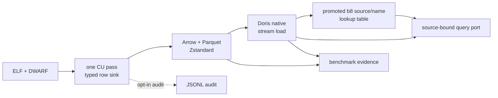

# Analytical DWARF store reference

This page describes the supported store boundary for generation and knowledge export. The
research record, compatibility gates, and measured-evidence ledger live in
 [`Feature 019 specification`](https://github.com/ddon-research/ddon-dwarf-reconstructor/blob/main/specs/019-analytical-dwarf-store/spec.md).

## Contract

`artifacts materialize-dwarf` opens the named ELF, traverses every compilation unit once, and
publishes an atomic, source-bound directory. The canonical logical contract is a typed row stream
written directly to Parquet. `records.jsonl` is an opt-in audit/interchange
projection for fixtures and targeted debugging. Both contain source identity and section inventory
records, CU headers, every DIE including null terminators, stable traversal ordinals,
parent/reference edges, and attributes with both raw and decoded tagged values. Unsupported forms,
duplicate offsets, offset zero, supplementary references, and unresolved targets remain records
rather than being discarded.

The derived families are also typed and source-bound: `range`, `location`, `line`, `macro`, `frame`,
`abbreviation`, and `name`. They retain the original record offsets and parser status. Macro sections
are published as `raw_only` rows with a checksum when the installed pyelftools API does not expose
a decoder; the raw section remains available for a later decoder or external LLVM cross-check.

The Doris runtime facade consumes the typed `line` family through the serving projection. It
reconstructs the CU file list and line-state entries needed by declaration-file resolution, so
generation does not reopen the ELF or read Parquet merely to recover line-program metadata.

Raw sections are copied with bounded I/O into checksummed files. Large byte attributes are external
checksummed chunks referenced by typed value columns (and, when enabled, by the JSONL audit row).
The manifest validates all relative paths and the current source hash before a runtime can open the
store. A complete manifest also records the producer/schema/configuration identity, CU and family
counts, and one immutable descriptor for every closed Parquet file: relative path, family, byte
size, modification timestamp, SHA-256, compression, footer status, and row-group row counts. The
publisher validates the hashes and reads every closed row group before complete publication. Normal
store loading validates the closed footer plus recorded size and modification metadata;
`inspect-dwarf-store` also verifies the full file hashes and compressed payload readability.

Publication completeness and DWARF semantic completeness are separate evidence fields. A source may
use an explicit, source-identity-bound recovery profile only when an independent LLVM dump records
the affected DIEs and guarded context bytes. When the original contexts are present, the profile is
an in-memory overlay and raw sections retain the original bytes. When all repaired contexts are
already present in the source, no overlay is installed and the manifest records
`status=already_applied`; this preserves the source bytes while retaining the same semantic
evidence. In both cases `configuration.dwarf_recovery` records the profile, evidence artifact, and
every replacement. The recovered DDOORBIS profile restores three `DW_TAG_formal_parameter [15]`
records and their six verified bytes before pyelftools traversal.

Without an approved recovery profile, malformed DWARF may still produce closed Parquet files and raw
sections, but the outer manifest is `partial` and records `configuration.parse_error_count > 0`.
The affected unit is marked `parser_status=partial`, its diagnostic includes the invalid form/code
and source offset, and the raw section/chunk rows remain authoritative. Such a publication is
storage-complete for diagnostics but is not runtime or header-acceptance evidence: generation,
knowledge export, Doris loading, and parity remain fail-closed until the
affected query surface is recovered or explicitly accepted by the evidence gate. A known source
without its required recovery profile is also rejected as stale.



The production path deliberately does not serialize JSON and then reload it into Doris. Arrow
rows are normalized once during the CU pass, Parquet is the replayable physical input format, and
Doris is loaded through the native-table path and is the sole normal serving backend. JSONL remains useful
when a person needs a line-oriented audit artifact or a small fixture, but it is not a required
intermediary or a runtime dependency.

## Commands

```powershell
uv sync --locked
uv run ddon-dwarf-reconstructor artifacts materialize-dwarf <ELF> `
  --output-dir <external-store-root> --write-parquet
uv run ddon-dwarf-reconstructor artifacts materialize-dwarf <ELF> `
  --output-dir <external-store-root> --write-jsonl --write-parquet
uv run ddon-dwarf-reconstructor artifacts materialize-dwarf <ELF> `
  --output-dir <external-store-root> --checkpoint-every-cus 64
uv run ddon-dwarf-reconstructor artifacts materialize-dwarf <ELF> `
  --output-dir <external-diagnostic-root> --max-cus 1
uv run ddon-dwarf-reconstructor artifacts inspect-dwarf-store <manifest.json>
uv run ddon-dwarf-reconstructor artifacts inspect-dwarf-store <checkpoint.json> `
  --allow-incomplete
uv run ddon-dwarf-reconstructor performance benchmark-dwarf-store <ELF> `
  --store-manifest <checkpoint.json> --allow-incomplete --output-dir <external-diagnostic-root>
uv run ddon-dwarf-reconstructor performance benchmark-dwarf-store <ELF> `
  --output-dir <external-benchmark-root>
uv run ddon-dwarf-reconstructor performance benchmark-dwarf-store <ELF> `
  --output-dir <external-benchmark-root> --run-current-baseline `
  --baseline-dwarf-dump <external-dump.zst> --baseline-dwarf-index <external-index.sqlite3>
uv run ddon-dwarf-reconstructor artifacts load-doris <manifest.json> `
  --dry-run
uv run ddon-dwarf-reconstructor artifacts load-doris <manifest.json>
```

`generate` and `export-knowledge` require the same source-bound manifest through `--dwarf-store`.
Before either command, the complete manifest must be loaded successfully into Doris; the loader
publishes a source registry only after the observed family counts reconcile with the manifest.
They do not implicitly materialize, open the ELF for a fallback traversal, read Parquet/JSONL, or
consult the old compressed-text SQLite index. Store-backed session setup also disables automatic
sibling and environment dump discovery. The old index remains available only for explicitly
labeled parity and cross-check evidence.

For durable local reuse, place the complete store under
`output/analytical-dwarf/main/store-<source-sha16>/`. Use `%TEMP%\ddon-analytical-dwarf` for
checkpoints, bounded probes, profiler output, and crash evidence only. A checkpoint or `--max-cus`
publication is diagnostic and requires `--allow-incomplete`; it is not a generation or Doris
input.

## Projection and query policy

Parquet uses one nullable typed schema per record family. Offsets, names, forms, relations, and
common scalar DWARF values are physical columns; only genuinely heterogeneous tagged values use a
per-value JSON escape column. Unsigned DWARF integers use exact `DECIMAL(20,0)` Parquet columns
instead of Arrow `UINT64`: Arrow restores them to Python integers, while Doris maps the
corresponding native columns to `LARGEINT` without signed-`BIGINT` overflow. This is a physical
compatibility rule, not JSON
stringification. Rows are written during CU traversal, not by re-reading JSONL. The canonical
projection is partitioned by family and source identity, with
Zstandard compression, 512 MiB fact-table and 128 MiB derived-index row-group targets, 4,096-row
Arrow flush thresholds, and hard native-conversion caps of 65,536 fact rows and 32,768 derived
rows. The caps protect the Windows pyarrow conversion boundary when constant-time row-size
estimates understate nested DWARF values. The opt-in `bucketed` layout adds `unit_bucket` to
directory partitioning for historical or measured pruning experiments; it is not the canonical
producer layout. Both layouts retain the physical
`unit_bucket` `int64` column so row-group statistics and explicit filters remain available. Doris
native
tables mirror those families with `DUPLICATE KEY` semantics, source-first/offset sort keys,
`HASH(source_id, unit_offset)` distribution for unit-scoped families, Bloom filters for equality
lookups, and inverted indexes on names and attribute names. JSON escape columns are never primary
indexes. Arrow dataset consumers must use the repository's layout-specific typed Hive partition
schema: family stores declare `source_id: string`, while historical bucketed stores additionally
declare `unit_bucket: int64`; automatic directory inference is not authoritative. The analytical
default runtime analytical baseline is `pyarrow==25.0.0`, `PyMySQL==1.2.0`, and `SQLAlchemy==2.0.51`. The local Doris benchmark uses
pinned 4.1.3 FE/BE images. MySQL/PyMySQL remains the default connection and load path; Doris
documents Arrow Flight SQL as experimental, so it is an opt-in benchmark profile with separate
FE/BE ports rather than the default runtime.

### Arrow Flight SQL evaluation profile

Flight SQL is an optional read benchmark, not a replacement for the semantic store connection.
Install its isolated dependency group only when the Doris Flight listener is enabled:

```powershell
uv sync --group flight-sql --locked
docker compose --file ops/analytical-dwarf/compose.yaml --file ops/analytical-dwarf/compose.flight.yaml up -d
uv run --group flight-sql ddon-dwarf-reconstructor performance check-doris-flight `
  --output "$env:TEMP/ddon-analytical-dwarf/analytical-flight/doris-flight-preflight.json"
uv run --group flight-sql ddon-dwarf-reconstructor performance benchmark-doris-flight `
  --store-manifest output/analytical-dwarf/main/store-4236f598acc8f158/manifest.json `
  --output-dir "$env:TEMP/ddon-analytical-dwarf/analytical-flight" `
  --allow-unparameterized-flight-fallback --reused-connections-only
```

The base Compose file is unchanged. The benchmark overlay exposes FE Flight on `8070` and BE
Flight on `8050`, applies the corresponding `arrow_flight_sql_port` settings, and advertises
`public_host=127.0.0.1` for the local BE DoGet endpoint. Set `DDON_DORIS_FLIGHT_SQL_PUBLIC_HOST` and
`DDON_DORIS_FLIGHT_SQL_PUBLIC_PORT` when a proxy or non-local deployment changes the endpoint
returned by Doris; the overlay applies those values as the BE public host/proxy port. The preflight report hashes both Compose files and the rendered configuration,
checks TCP reachability, and records bounded FE/BE startup-log marker results. Set
`DDON_DORIS_FLIGHT_SQL_FE_PUBLIC_HOST` to record a host-side FE socket check for FE-local result
sets. That check does not rewrite the FE `Location` returned by Doris 4.1.3: the current producer
constructs it from the FE process-local address, so a reachable host-published FE port is not proof
that a returned FE-local `DoGet` address is reachable. A successful FE connection alone is
insufficient if the BE endpoint cannot be reached.

The benchmark uses qmark (`?`) parameters and records separate execute/GetFlightInfo, fetch/DoGet,
and Python conversion/reduction timings. Its result matrix includes PyMySQL `fetchall()`, Flight
row conversion, `fetch_arrow_table()`, streamed `fetch_record_batch()`, and an Arrow-native batch
reducer. Derived child-tag and name-count experiments compare that client reducer with Doris
`GROUP BY` queries using the per-query `SET_VAR(enable_parallel_result_sink=true)` hint; this avoids
an extra FE-local `SET` result exchange while retaining the parallel-result experiment. It preserves
source/CU/DIE keys, duplicate multiplicity, ordering, nulls,
`decimal128(20,0)`/`LARGEINT`, binary/JSON values, arrays, datetimes, and offsets. The benchmark
also compares N+1 definition hydration with bounded set-based batches of 32, 128, 512, and 2,048
candidate offsets. It does not change DDL, HTTP Stream Load, or the domain `DwarfQueryPort`.

The current preflight observes FE `127.0.0.1:8070`, the configured FE public socket
`192.168.178.81:8070`, BE `127.0.0.1:8050`, both Doris Flight startup markers, and the direct local
BE route. The benchmark-only `--allow-unparameterized-flight-fallback` flag renders supported
qmark values as checked SQL literals after the required probe fails; it never changes the default
runtime path and reports Flight as `partial`. The latest complete reused-connection matrix is
externalized at `C:\Users\morph\AppData\Local\Temp\ddon-analytical-dwarf\analytical-flight\full-fallback-reused-v3\doris-flight-report.json`.
It observes 36 definition/contract reports per transport, the six array sizes, both hydration
strategies, and the Arrow consumption modes. `fetchall()` remains an intentional negative control.
Strict cross-transport parity is still partial: the matrix compares 76 common row-mode reports,
with 54 exact digests and 22 mismatches; the mismatches preserve row count, order, schema, nulls,
and values but expose Doris `BOOLEAN` as Python `int` through PyMySQL and `bool` through Arrow.
The current source also returns FE-local result locations from its process-local address, so that
routing/type boundary remains open even though the data queries and BE route complete. Promote
Flight only after exact type parity, clean endpoint routing, point-query p95 within 110% of MySQL in
cold and warm runs, and a representative Arrow-native workload demonstrates at least a 20%
end-to-end or peak-RSS improvement.

### PyArrow 25 design boundary

The default project runtime pins `pyarrow==25.0.0`. The local PyArrow reference checkout at
`D:\PyArrow-25.0-python-docs` is the first source for Arrow concept and API questions. Its schema,
Parquet, Dataset, and memory/IO sections support the implementation choices here:

- `schema_for()` supplies an explicit immutable Arrow schema for every record family. The producer
  does not infer a family schema from the first batch.
- `ParquetWriter` appends controlled row groups. The producer retains the 512 MiB/128 MiB progress
  targets but also caps the rows passed to `Table.from_pylist()` because nested DWARF values can
  make a constant-time byte estimate optimistic on the Windows native extension boundary.
- `pyarrow.dataset` readers use the layout-specific typed Hive partition schema, project only the
  needed columns, and apply source/CU filters. Large scans should use `to_batches()` rather than
  materializing a whole dataset with `to_table()`.
- `pa.total_allocated_bytes()` and `pa.default_memory_pool().backend_name` are useful bounded
  telemetry. They do not represent all Python/native RSS, and Arrow's `memory_map` option does not
  make compressed Parquet resident memory-free.

When a complete JSONL audit store later requests a Parquet projection, the backfill reuses the same
bounded `ParquetRecordSink` as direct materialization. It honors the existing manifest's
`parquet_layout` and `max_open_writers`, records writer metrics, validates closed footers and
payloads, and replaces the temporary projection atomically. This keeps the audit format an
interchange boundary rather than introducing a second unbounded writer implementation.

## Doris optimization boundary

The current schema uses append-only `DUPLICATE KEY` tables, source-first/offset sort keys, the
physical `unit_bucket` column, Bloom filters for source/offset/target equality, and inverted indexes for
names. Doris's [schema and index guidance](https://doris.apache.org/docs/4.x/query-acceleration/tuning/tuning-plan/schema-and-index-optimization/)
also requires checking key order, skew, prefix pruning, and scan behavior. A `SHOW INDEX` result or
an `EXPLAIN` plan alone is not a performance claim: the benchmark retains no-cache and warm
profiles with scan rows/bytes, operator time, peak memory, and spills using
[`doris-cli`](https://github.com/apache/doris-cli).

The default producer bounds native Parquet writers at 16 open family/source writers. The canonical
family layout avoids one writer per CU bucket and closes all family writers every 64 CUs by default;
`--rotate-writers-every-cus N` changes that interval and `0` disables boundary rotation. This is
not a checkpoint publication: the manifest records `cu_boundary_rotations` separately from
capacity and checkpoint rotations. The historical `bucketed` layout remains available for explicit
comparison. Override the open-writer bound with `--max-open-writers N` when measuring another
lifecycle. In-flight files still have no readable footer and are not a query surface; the manifest
records the configured layout, limit, peak open-writer count, and every rotation class. Row-group progress uses a
constant-time per-column estimate; it is only a flush trigger and never a storage-size or
correctness measurement, so the producer does not walk and UTF-8-encode every scalar on the hot
path. An explicit
`--checkpoint-every-cus N` mode additionally publishes an in-progress manifest after closing and
rotating writers at CU boundaries, records the immutable
file list in `checkpoint.json`, and preserves the latest checkpoint after an interruption. The
checkpoint manifest has status `in_progress`; loading it requires the explicit
`--allow-incomplete` inspection flag and query results are `partial`. Normal generation, Doris
loading, and complete-store lookup continue to reject it. Checkpoints are a diagnostic/query
surface, not complete-ELF coverage evidence, and their writer-rotation overhead must be measured
before using them for a production benchmark. The matching diagnostic benchmark command accepts
the checkpoint manifest with `--store-manifest --allow-incomplete`; it queries only the immutable
Parquet file list recorded by that checkpoint, reports a `partial` report, and marks Doris
`not_observed`. It never treats open parts or a partial query as production evidence.

`--max-cus N` is a separate bounded parser/schema probe. It publishes a `partial` manifest after
the requested CU prefix and is useful for real-ELF compatibility checks without waiting for the
full corpus. It cannot load into Doris, satisfy generation or knowledge-export
requirements, or count as complete-CU evidence. A bounded probe is inspected only with
`--allow-incomplete` and must remain under an external diagnostic directory.

The first service review also found that the already-loaded v9 fixture predates the source-first
DDL: its `SHOW CREATE TABLE` still uses offset-first keys and `HASH(unit_offset)`, and its tiny
`EXPLAIN` touches all 16 tablets. The revised generator now places every `DUPLICATE KEY` column
at the physical schema prefix, as required by Doris, and a fresh high-value database accepted the
fourteen-table DDL, loaded eight files, and completed statistics. The old service tables are not
retroactively treated as evidence for the revised layout; the fresh tiny-fixture profile still
touches every tablet, so full-corpus pruning and latency remain open benchmark questions.
Global DIE-offset lookup without a CU offset is a separate candidate: if the full query suite shows
it dominates, add a narrow source/DIE locator projection rather than widening the hot fact query.
That duplication is deliberately not enabled from the tiny-fixture evidence alone.

Native loading uses HTTP Stream Load for local Parquet. Doris's [POC checklist](https://doris.apache.org/docs/4.x/getting-started/before-you-start-the-poc/)
and [load guidance](https://doris.apache.org/docs/4.x/data-operate/import/load-manual/) support
that choice for local files, while the checked-out source is
`D:\Apache-Doris-version-4.x-docs`. Statistics are an explicit evidence step: Doris's [statistics
guide](https://doris.apache.org/docs/4.x/query-acceleration/optimization-technology-principle/statistics/)
supports manual `ANALYZE` for native tables; `artifacts load-doris` submits it by default and
`DDON_DORIS_ANALYZE_WAIT_SECONDS` optionally waits for `SHOW ANALYZE` terminal states. The
`information_schema.statistics` and `information_schema.column_statistics` compatibility views
remain empty; use `SHOW TABLE STATS`, `SHOW COLUMN STATS`, `SHOW ANALYZE`, `SHOW AUTO ANALYZE`, and
`__internal_schema.column_statistics` for Doris statistics evidence.
Materialized
views are deferred because the one-pass producer already
materializes definition and method indexes; they are added only if full-export profiles expose a
repeated join or aggregation hotspot.

The query port returns structured completeness and provenance. `partial`, `unavailable`, and
`not_found` are distinct states; a partial analytical result cannot be consumed as complete
generation evidence. Doris plans are emitted without contacting the service; execution and
`EXPLAIN`/profile output are separate acceptance evidence. The two legacy baseline workloads are
opt-in because the live pyelftools path and a missing compressed-dump sidecar can each require a
large full scan. The report keeps each baseline `not_observed` or `blocked` until explicitly run;
neither state can satisfy the 110%-of-baseline gate.

The current live-Doris benchmark adds schema-comparable diagnostics without changing the serving
schema or measured PyMySQL result path. Its schema-`1.2` report writes raw artifacts outside the
repository and retains source identity, schema/session context, exact SQL hashes, normalized
`EXPLAIN`/`EXPLAIN VERBOSE`, query IDs, cold/warm result hashes, raw/full profiles, fetch duration,
operator summaries, scan/tablet/cardinality/predicate signals, and explicit incomplete states.
`doriscli` is preferred; PyMySQL plan capture and the FE profile HTTP endpoints are fallbacks.
The default diagnostic scope is limited to the explicit Doris suite. `--trace-generation-queries`
extends it to the actual query executor in each generation child, writing redacted JSONL
observations and bounded FE-local profile artifacts outside the repository. The trace retains
query-shape digests, timings, rows, query IDs, scan/tablet/operator/memory/spill metrics, and
explicit profile status; it never retains parameter values. A bounded `LIMIT 1001` first-definition
query remains a bounded compatibility contract, not a complete `rAIFSM` hierarchy query; a stale,
evicted, mismatched, or timed-out profile is never accepted for another query.

The opt-in `benchmark-doris-optimization` route evaluates one isolated candidate at a time. Its
typed report records the source/schema/DDL/configuration-bound serving variant, complete row counts,
load/statistics/tablet evidence, cold/warm samples, output hashes, rejected/not-applicable
optimizations, and the 10% improvement/110% regression promotion gate. Candidate lookup tables are
source-bound and populated from the canonical index or DIE family; the canonical fourteen-family
contract and registry remain unchanged. The default statistics policy is selective: key, filter,
order, name, target, parent, and resolution columns are sampled up to 4,194,304 rows per family;
payload/raw/detail columns are excluded unless a trace proves they are predicates. A promoted load
must wait for every requested statistics job to reach a terminal-success state and retain raw
`SHOW TABLE STATS`, `SHOW COLUMN STATS`, `SHOW ANALYZE`, `SHOW AUTO ANALYZE`, and
`__internal_schema.column_statistics` evidence.

The first complete-store optimization evaluation ran on 2026-08-09 and identified sequential DIE
and attribute hydration as the dominant cost. The source/unit-bound 512-key batch screen was
`34.1x` faster with exact row parity. The generator now consumes bounded batches for DIE metadata,
attributes, child frontiers, reference targets, and child-tag counts, and caches line programs per
compilation unit while preserving the canonical schema and registry.

The current optimized serving path completed exact `rLayout` in `13.195 s` and exhaustive
`rAIFSM` in `19.811 s`, `20.166 s`, and `20.784 s`; all 11 headers matched the approved hashes. A paired traced
`rAIFSM` run recorded `754` redacted observations and published the same output, but took
`39.589 s` because tracing exceeded the 5% overhead budget. Its FE profiles were all `partial`
due to query-ID mismatch, so traced wall time is attribution-only. The semantic trace identified
batched attribute/reference/DIE hydration and point-DIE lookups as the dominant query operations.
Name lookup buckets 2 and 8 reduced global lookup scheduling to 1/2 and 1/8 tablets, respectively,
but full confirmation reached only about 10% warm p50 and 5% warm p95 improvement; neither is
promoted. A grouped child-tag aggregation reduced one bounded result but was end-to-end tied with
the raw path and was removed. The canonical
physical design remains the default; index removal, bucket changes, V2/V3, ZSTD/LZ4,
pipeline/session tuning, and Stream Load worker comparisons are `not_observed` rather than inferred
from `EXPLAIN` or partial profiles.

The 2026-08-10 policy recheck used the refreshed canonical registry identity without reloading or
changing the fourteen canonical family tables. The combined serving path now makes lazy reference
prefetch, the decoded-serving attribute projection, and the source/name b8 lookup table the normal
generation defaults. It measured `16.1152/16.1187 s` warm exhaustive `rAIFSM` p50/p95 versus
`19.1208/19.1271 s` for the prior canonical path, a `15.7%` improvement at both quantiles, with
exact output and lower warm p95 RSS. Raw attribute columns remain stored in the canonical
attribute family; the serving projection narrows the generation fetch and is covered by the full
Season 2 parity gate. The targeted child-tag filter was exact but regressed warm p50 by `10.5%`
and was rejected. This route is a reusable, change-triggered one-shot regression/promotion
command, not a continuous service.

The fair-path screen of `unit-bound-hydration` then preserved the exact 11-header bundle but took
`289.048 s` for exhaustive `rAIFSM` (`n=1`) against the canonical `19.121/19.127 s` warm
p50/p95. A partial attribution trace recorded `26,463` observations, including `9,262`
attribute-by-DIE, `7,579` reference-prefetch, and `9,136` child-tag-count queries; the canonical
trace had `85`, `154`, and `25`. The known unit predicate increased round trips and is rejected.
The canonical global hydration scope remains the default; no physical table or registry contract
changed.

The positive-below-gate interaction batch then activated lazy reference prefetch, the
decoded-serving attribute projection, and source/name lookup buckets 2, 4, and 8 together, with
b8 active. Its three-cold/five-warm confirmation preserved the exact approved 11-file bundle and
measured `16.1152/16.1187 s` warm p50/p95 versus canonical `19.1208/19.1271 s`—approximately
`15.7%` faster at both quantiles. Warm p95 RSS fell from `164,102,144` to `136,142,848` bytes.
The promoted b8 table added `399,984,557` bytes, or `7.23%` over the complete canonical table
total, and all auxiliary tablets were `NORMAL`. A follow-up selective analysis of its key/filter
columns produced two manual `FINISHED` jobs with 1,048,576-row samples and zero failed subjobs;
older automatic-analysis failures remain historical context. b2 and b4 remain comparison-only
benchmark candidates; the canonical loader creates and refreshes b8 automatically. The canonical
fourteen-family row contract and registry counts remain unchanged.

The same fail-closed rule applies to a non-zero `parse_error_count`: the closed files and raw
evidence may be inspected diagnostically with `--allow-incomplete`, but a runtime consumer must
not silently treat missing structured rows from a partial CU as complete. Applying a recovery
profile is not a waiver: the full traversal must still finish with zero parse errors, complete-CU
counts, payload validation, and header/query parity.

### Promoted main store and current serving boundary

The promoted v1.1 source-bound store is
`output/analytical-dwarf/main/store-4236f598acc8f158/manifest.json`. Its manifest records 2,305
compilation units, 597,338,011 typed rows, 1,452 closed Zstandard Parquet artifacts, and zero
parser diagnostics. This durable path is the canonical input for current generation, knowledge
export, and native-Doris loading. `%TEMP%\ddon-analytical-dwarf` remains a disposable location
for checkpoints, bounded probes, profiles, and crash diagnostics; a Temp path or versioned run
label is not a durable store identity.

The loader's supported Doris database default is `dwarf`. Versioned databases and external Temp
stores in the sections below are historical serving measurements. Current evidence includes
native row-count parity, authoritative `SHOW TABLE STATS`/`SHOW COLUMN STATS`/`SHOW ANALYZE`
evidence, healthy tablets, cold/warm profiles, and the completed full Season 2 generation run.
The per-header MSVC syntax/closure gate is now observed and clean; IDA/Sonar evidence and byte
comparison with the unavailable historical approved `rLayout.h` remain separate boundaries. The
removed Iceberg runtime is not part of the current loading or acceptance path.

### Historical full-corpus Doris serving result (v9)

The complete v9 store was loaded into native Doris database `dwarf_full_v9_20260806` using 413
concurrent-capable, individually labeled Parquet Stream Loads. The 14 family counts equal the
source-bound manifest: 596,944,504 rows, including 95,540,741 DIEs and 35,682,130 derived index
rows. All native tables are `NORMAL`, all 14 statistics jobs finished without failure, and the
source/CU/DIE plan prunes `full_die` to one of 16 tablets.

The full name lookup has a different access shape. The canonical `full_index` table touches all
eight index tablets when only `source_id`, `index_type`, and `name` are known. A separately
provisioned `full_index_name_candidate` serving projection was measured with the compiled Doris
CLI: ordered `rLayout`/`MtObject` results match the canonical index, scan bytes fall from about
155 MB to 34 MB, and the paired no-cache profile falls from 13 ms to 6 ms. The full 36-query
suite improves only about 3.7%, so the projection is opt-in through
`DDON_DORIS_DEFINITION_LOOKUP_TABLE` and is not part of the canonical physical family model.

The direct Parquet adapter now hydrates all indexed definition DIEs in one batched DIE scan and
one batched attribute scan. The complete v9 contract report returned 145 ordered `rLayout`
definitions in 0.692 s cold and 0.804 s warm through the typed Parquet path; a duplicate-index-row
regression test preserves result multiplicity. This is a correctness/per-file-runtime improvement,
not a replacement for Doris's serving profile or the unobserved 110%-baseline gate.

The same profile-led loop found a second repeated scan in definition ranking: child tag counts were
being read once per candidate. The adapter now primes all missing parent offsets with one projected
DIE scan. The complete-store benchmark preserves the 145 ordered `rLayout` matches and reduced the
store-port cold lookup from 349.532 s and 21.327 GB read to 42.985 s and 2.812 GB read; the direct
Parquet path stayed sub-second. This optimization is in the file adapter and does not alter the
canonical Doris schema.

The live header trace also exposed CU-unscoped reference and child scans during type and array
parsing. The adapter now adds the known DIE `unit_offset` to those predicates. In the canonical
family layout, this is a physical-column and row-group-statistics filter rather than directory
partition pruning; the historical bucketed layout retains directory pruning. The active run that
exposed the path predates this edit, so its performance and header output remain diagnostic until
a fresh run completes. The post-edit query-contract benchmark reduced the representative `children` scan from 6.594 s and
589.6 MB read to 3.633 s and 105.9 MB; the complete header result is still pending.

The next current-code probe found that a single cross-partition 145-value attribute `IN` scan could
raise a Zstandard decompression error. Definition hydration now reads the DIE rows once, batches
wide attribute rows by `unit_bucket`, retries without Arrow threads, and recursively splits a CU
batch when the scan shape is too wide. The fresh `rLayout` query returned all 145 matches in 16.819 s;
cProfile recorded 17.856 s and 178 Parquet row scans, down from 45.973 s and 577 scans before the
change. This remains query-adapter evidence: the later full payload audit found an unreadable
`decoded_value_kind` page in v9 attribute row group 10, so a replacement store must pass row-group
read validation before a fresh generated header can establish parity.

The repository `profile-dwarf-store` command captures cProfile method/line evidence and Scalene
process/memory evidence; Doris CLI profiles determine storage/index conclusions. Runtime
performance comparisons use only native Doris and the prior live lookup baseline. The current
bounded real-ELF Scalene run completed with 147 samples and ranked only import-time setup at
`zstd_dump_parser.py:36`; no actionable application-file CPU hotspot is asserted. Raw profiler
output defaults to `%TEMP%\ddon-dwarf-reconstructor\performance` on Windows, or an explicit
`DDON_PERFORMANCE_ARTIFACT_DIR`.

## 2026-08-09 current live-Doris baseline

The current-data benchmark reused the promoted manifest and the existing `dwarf` database. No
materializer, Stream Load, DDL, projection, materialized view, or schema change ran during this
measurement. The manifest and registry both bind to source SHA-256
`4236f598acc8f15893181455ed195e39dfa4dbfda4eeda8b56fcbd82312c63c0`, schema `1.1`, 2,305 CUs,
and the exact fourteen-family counts. The external report is
`C:\Users\morph\AppData\Local\Temp\ddon-analytical-dwarf\current-doris-route-20260809\current-doris-benchmark.json`.

| Workload | Status | Wall time | Peak RSS | Output evidence |
| --- | --- | ---: | ---: | --- |
| `MtObject` cold / warm | `observed` | 111.694 / 79.477 s | 90.2 / 90.3 MB | One `MtObject.h`; SHA-256 `5cd6e1b8939260ad8456d7313b15ee984e111e394c855568c3ae743e91cfde2c` |
| `rLayout` cold / warm | `observed` | 236.416 / 213.274 s | 131.9 / 132.3 MB | `rLayout.h`; SHA-256 `759cf157efc5f9609966a64a8932dd5f9786e0b24f3c473f4e14d8ba8e5e46e9` |
| `rAIFSM` long | `observed` | 347.064 s | 166.2 MB | 11 ordered headers, 41,236 bytes; `rAIFSM.h` SHA-256 `0c63ec7c7267e362b344c8b9a45f6a2d850c8d941a93788cd1481661f58649b` |

The existing bounded SQL contract returned 1,001/145/343 rows for `MtObject`/`rLayout`/`rAIFSM`
definition lookup and records ordered-result hashes. It remains a bounded first-definition
contract. Separate full profiles for the current `rLayout` and `rAIFSM` name lookups show 35/40 ms
total time, 5 ms scheduling, 145.55/194.81 MB scan bytes, 145/343 scan rows, and all 8 of 8
`dwarf_records_index` tablets touched; no spill counter was observed. The raw and parsed profiles,
tablet sweep, table/column statistics, DDL, and analyze history are retained under
`C:\Users\morph\AppData\Local\Temp\ddon-analytical-dwarf\current-doris-route-20260809\doris-state`.

All fourteen manual `SHOW ANALYZE` jobs are `FINISHED`. The retained automatic history contains
four earlier `FAILED` jobs for `attribute`/`name` caused by backend memory limits; this is historical
optimizer evidence, not a claim that every automatic job succeeded. Every tablet in the fourteen
family sweep was `NORMAL`; the largest live table was `attribute` at 2,589.7 MB with skew 1.2.
These observations establish the current serving baseline only. Candidate access paths and
materialized views remain unevaluated until they demonstrate exact ordered parity and end-to-end
improvement on the heavy `rAIFSM` generation workload.

### Season 2 per-header MSVC closure audit

The complete Season 2 root set was regenerated from the source-bound manifest in four external
batches. The bulk run published 289/289 roots with zero generation failures and exact manifest
byte/hash integrity. The follow-up audit compiled every header as an independent MSVC translation
unit: 289 bundles and 2,760 headers all passed with no timeouts.

The compiler audit exposed and corrected three classes of generator defect: nested base edges were
lost at the hierarchy-depth limit; flattened nested base names were emitted without their owning
type qualification; and nested template arguments were rendered with class forward declarations
instead of template forward declarations. A fourth semantic defect excluded `DW_TAG_namespace`
from store-backed root discovery, so `rAcquirement` was incorrectly emitted as a not-found
placeholder. The final audit contains no not-found, unknown-type, unresolved, or synthetic-type
markers and no unresolved compiler diagnostics. Remaining `C4099`, `C4201`, and `C4309` diagnostics
are warnings only: declaration-kind mismatches, intentional nameless structs/unions, and a
narrowing-conversion warning respectively.

The final external inputs are
`C:\Users\morph\AppData\Local\Temp\ddon-analytical-dwarf\season2-msvc-fix4-20260810-input` and
`C:\Users\morph\AppData\Local\Temp\ddon-analytical-dwarf\msvc-season2-fix4-20260810\msvc-header-validation.json`.
The generated-header content is therefore compiler-clean and symbol-resolvable within the
source-bound closure; it is not a claim of byte parity against the missing historical approved
header baseline.

## Evidence boundary

Deterministic fixture tests prove record ordering, source binding, projection round trips, and
query adaptation. They do not prove full-corpus completeness or production performance. The local
PS4 ELF and external compressed dump are explicit environmental inputs. LLVM verification requires
an available executable; a source checkout alone is not an observation. Doris acceptance requires a
healthy local daemon, immutable image digest, load output, query plans, and cold/warm repetitions.
Real artifacts, Parquet files, Doris data, and benchmark logs stay outside source
control.
