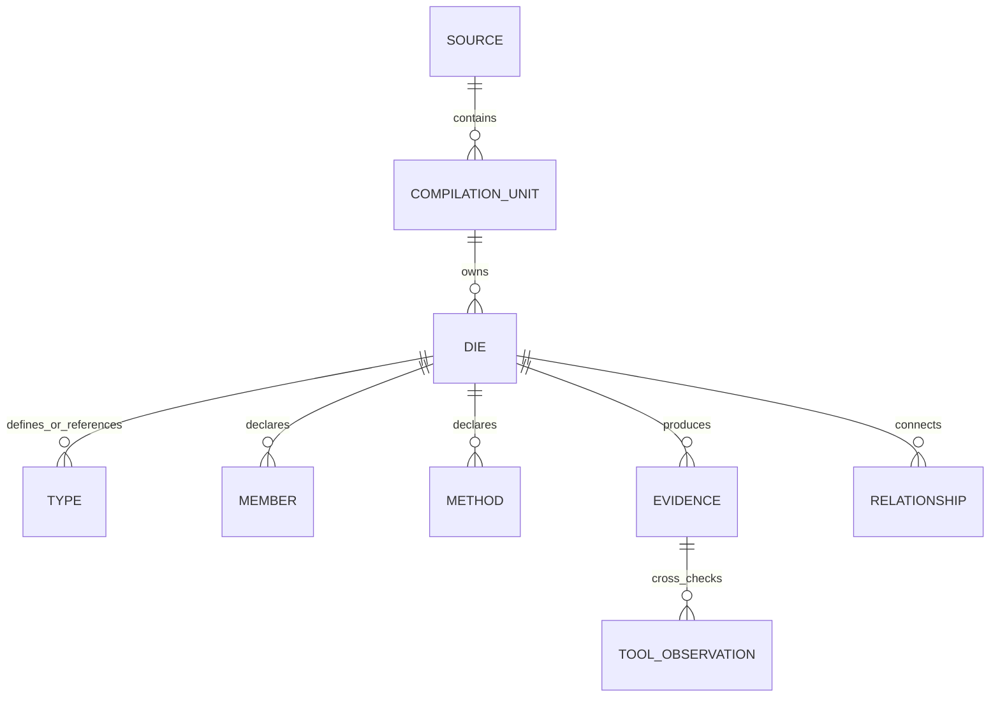

# Knowledge graph contract

The current graph projection is a deterministic interchange bundle. It is deliberately useful
without a database server and explicit about what has not yet been built.

## Published records

`nodes.jsonl` contains typed producer and evidence nodes. `relationships.jsonl` contains stable
edges. `instructions.jsonl` records reconstruction or consumer guidance. `reconstructed_cpp`
provides a human-readable projection, and `manifest.json` binds the bundle to its source,
configuration, schema, and checksums.

## Authority and uncertainty

The owning DIE is authoritative for producer facts. Tool observations are additive and retain
their tool/profile/source provenance. Missing data is represented as `not_observed`; partial
search results are not complete evidence. Conflicting or unavailable observations remain visible.

## Next graph step

The repository does not currently publish a Neo4j database, graph API, or interactive graph view.
The next implementation should define a versioned loader over the existing JSONL contract, preserve
producer authority, and add deterministic query fixtures before a live deployment is introduced.
This is the unchecked `KG-001` task in the
[documentation style and governance feature](https://github.com/ddon-research/ddon-dwarf-reconstructor/tree/main/specs/013-documentation-style-governance).
It remains a roadmap task; this static site does not imply that the loader or a live deployment
exists.
